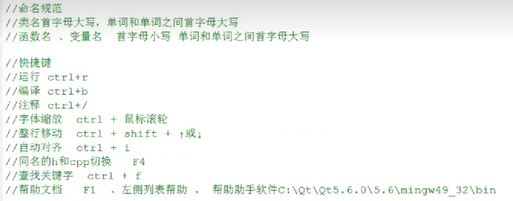
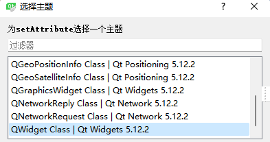

[TOC]
#课程来源于“斧头帮帮主“
案例：
Linux桌面环境下KDE，WPS，网络电话，谷歌地图，VLC多媒体播放器，虚拟机软件。。。




基本使用：
QPushButton是Widget的子类。


#课程来源于“B站北京讯为电子”
信号：控件发出特定的信号。
槽：即槽函数，可以把槽函数绑定在某一个控件的信号上。
如何关联信号和槽：1.自动关联；2.手动关联。
2.手动关联，使用connect函数：


> connect(myBtn,&MyPushButton::clicked,this,&MyPushButton::close);
> 参数：1.信号发送者（指针）2.发送的信号地址3.信号的接收者（指针）4.槽函数地址

emit:触发自定义信号
函数指针的返回类型void

对象树：


lambda表达式：版本低在Pro文件下加CONFIG += c++11


# QMainWindow：
## 1、自定义对话框
菜单、工具栏、状态栏、铆接部件、核心部件的创建：
```C++
//1.菜单栏,只有一个
QMenuBar *bar = menuBar();
//菜单栏设置到窗口中
this->setMenuBar(bar);
//添加 菜单
QMenu *fileMenu = bar->addMenu("文件");
QMenu *editMenu = bar->addMenu("编辑");
//添加菜单项
QAction *newAction = fileMenu->addAction("新建");
//添加分割线
fileMenu->addSeparator();
QAction *openAction = fileMenu->addAction("打开");

//菜单项中添加子菜单
QMenu *subMenu = new QMenu;
subMenu->addAction("子菜单1");
subMenu->addAction("子菜单2");
newAction->setMenu(subMenu);

//2.工具栏 可以有多个
QToolBar *toolBar = new QToolBar(this);
//将工具栏设置到窗口
addToolBar(Qt::LeftToolBarArea,toolBar);
//设置只允许左右停靠
toolBar->setAllowedAreas(Qt::LeftToolBarArea | Qt::RightToolBarArea);
//设置浮动
toolBar->setFloatable(false);
//设置移动
toolBar->setMovable(false);
//添加菜单项
toolBar->addAction(newAction);
toolBar->addSeparator();
toolBar->addAction(openAction);

//3.状态栏 只有一个
QStatusBar *sBar = statusBar();
setStatusBar(sBar);
QLabel *label1 = new QLabel("左侧信息",this);
sBar->addWidget(label1);
QLabel *label2 = new QLabel("右侧信息",this);
sBar->addPermanentWidget(label2);
QLabel *label3 = new QLabel("左侧信息2",this);
sBar->insertWidget(0,label3);

//4.铆接部件 浮动窗口 可以多个
QDockWidget *dock = new QDockWidget("浮动窗口",this);
addDockWidget(Qt::BottomDockWidgetArea,dock);
//设置只允许上下停靠
dock->setAllowedAreas(Qt::TopDockWidgetArea | Qt::BottomDockWidgetArea);

//5.核心部件 中心部件 只有一个
QTextEdit *edit = new QTextEdit(this);
setCentralWidget(edit);
```

菜单栏添加图标：


对话框的创建：
```c++
//新建弹出对话框
connect(ui->actionnew,&QAction::triggered,[=](){

//对话框分类
//模态对话框  不可以对其他窗口操作  阻塞
//非模态对话框  可以对其他窗口操作   非阻塞

//创建模态对话框
QDialog dlg(this);
dlg.resize(200,100);
dlg.exec();

//创建非模态对话框
QDialog *dlg = new QDialog;
dlg->show();
//销毁对话框 防止内存泄漏
//设置属性 55号 使Qt在小部件接受关闭事件时删除该小部件
dlg->setAttribute(Qt::WA_DeleteOnClose);

qDebug()<<"弹出对话框";
});//trigger触发
```
设置对话框属性：QWidget::setAttribute()
查找：



## 2、消息对话框，系统提供QMessageBox即模态对话框
```c++
//QMessageBox 消息对话框
//1.错误提示
//QMessageBox::critical(this,"critical","错误!");
//2.消息提示
//QMessageBox::information(this,"info","消息提示!");
//3.询问提示
//参数1 父窗口 参数2 标题 参数3 中间显示文本框 参数4按键类型 参数5关联回车按键
//QMessageBox::question(this,"question","询问：",QMessageBox::Save | QMessageBox::Cancel);
if(QMessageBox::Save == QMessageBox::question(this,"question","询问：",QMessageBox::Save | QMessageBox::Cancel,QMessageBox::Cancel))
{
    qDebug()<<" choose save ";
}
else {
    qDebug()<<" choose cancel ";
}

//4.警告提示
QMessageBox::warning(this,"warning","警告！");
```

## 3、其他对话框：颜色、字体、文件
```c++
//颜色对话框
 QColor color = QColorDialog::getColor(QColor(255,0,0));
 qDebug()<<color.red()<<color.blue()<<color.green();
 
 //字体对话框
 bool ok;
 QFont font = QFontDialog::getFont(&ok,QFont("宋体",30));
 qDebug()<<"字体："<<font.family()<<"字号："<<font.pointSize()<<"加粗:"<<font.bold()<<"倾斜："<<font.italic();

 //文件对话框
 QString str = QFileDialog::getOpenFileName(this,"打开文件","E:\Wins_Qt\111\04_QResource\04_QResource","*.h *.cpp" );
 qDebug()<<str;
```


## QListWidget
```c++
//listWidget使用、
QListWidgetItem *item = new QListWidgetItem("hahahhahhah");
ui->listWidget->addItem(item);
//设置文本对齐方式
item->setTextAlignment(Qt::AlignHCenter);

//QStringList->QList<QString>->list<string>
QStringList list;
list<<"aaa"<<"bbb"<<"ccc"<<"ddd";
list.push_back("aaa");

ui->listWidget->addItems(list);
```

## QTreeWidget
```C++
//treeWidget  树控件
//1.设置头标签
ui->treeWidget->setHeaderLabels(QStringList()<<"英雄"<<"英雄介绍");

//2.Item创建
QTreeWidgetItem *liItem = new QTreeWidgetItem(QStringList()<<"力量");
//添加顶层级别的Item
ui->treeWidget->addTopLevelItem(liItem);

QTreeWidgetItem *secItem = new QTreeWidgetItem(QStringList()<<"敏捷");
ui->treeWidget->addTopLevelItem(secItem);
QTreeWidgetItem *thrItem = new QTreeWidgetItem(QStringList()<<"智力");
ui->treeWidget->addTopLevelItem(thrItem);

QStringList heroL1;
heroL1 <<"刚被猪"<<"前排坦克，能在吸收伤害的同时造成可观的范围输出";
QStringList heroL2;
heroL2<<"船长"<<"前排坦克，能肉能输出能控场的全能英雄";
QStringList heroM1;
heroM1 <<"月骑"<<"中排物理输出，可以使用分裂利刃攻击多个目标";
QStringList heroM2;
heroM2<<"小鱼人"<<"前排战士，擅长偷取敌人的属性来增强自身战力";
QStringList heroZ1;
heroZ1 <<"死灵法师"<<"前排法师坦克，魔法抗性较高，拥有治疗技能";
QStringList heroZ2;
heroZ2<<"巫医"<<"后排辅助法师，可以使用奇特的巫术诅咒敌人与治疗队友" ;

//3.创建子Item挂载到顶层Item上
QTreeWidgetItem *l1 = new QTreeWidgetItem(heroL1);
liItem->addChild(l1);
```

## QTableWidget
```C++
//tableWidget使用
//1.设置列数
ui->tableWidget->setColumnCount(3);
//2.设置水平表头标签
ui->tableWidget->setHorizontalHeaderLabels(QStringList()<<"姓名"<<"性别"<<"年龄");
//3.设置行数
ui->tableWidget->setRowCount(5);

//4.设置正文
//ui->tableWidget->setItem(0,0, new QTableWidgetItem("亚索"));

QStringList nameList;
nameList<<"亚索"<<"安其拉"<<"扁鹊"<<"夏洛特"<<"橘右京";
QList<QString> sexList;//定义用法同上
sexList<<"x"<<"o"<<"x"<<"o"<<"x";
for(int i = 0; i< 5; i++)
{
    int column = 0;
    ui->tableWidget->setItem(i,column++,new QTableWidgetItem(nameList[i]));
    ui->tableWidget->setItem(i,column++,new QTableWidgetItem(sexList.at(i)));
    //int转qstring  QString::number(int)
    ui->tableWidget->setItem(i,column++,new QTableWidgetItem(QString::number(18+i)));;
}

//添加英雄赵云
connect(ui->addBt,&QPushButton::clicked,[=](){
//如果有则不添加
bool isEmpty = ui->tableWidget->findItems("赵云",Qt::MatchExactly).isEmpty();
if(!isEmpty)
{
    QMessageBox::warning(this,"警告","已经有赵云，添加失败");
}
else {
    ui->tableWidget->insertRow(0);
    ui->tableWidget->setItem(0,0,new QTableWidgetItem(QString("赵云")));
    ui->tableWidget->setItem(0,1,new QTableWidgetItem(QString("x")));
    ui->tableWidget->setItem(0,2,new QTableWidgetItem(QString::number(29)));
}
});

//删除英雄
connect(ui->deleteBt,&QPushButton::clicked,[=](){
        bool isEmpty = ui->tableWidget->findItems("赵云",Qt::MatchExactly).isEmpty();
if(isEmpty)
{
    QMessageBox::warning(this,"警告","没有赵云");
}
else {
    int rowNum = ui->tableWidget->findItems("赵云",Qt::MatchExactly).first()->row();
    ui->tableWidget->removeRow(rowNum);
    }
});
```

## 其他常用控件
```c++
//默认选中第一个
ui->stackedWidget->setCurrentIndex(0);

connect(ui->tabBt,&QPushButton::clicked,[=](){
    ui->stackedWidget->setCurrentIndex(0);
});

connect(ui->toolBt,&QPushButton::clicked,[=](){
    ui->stackedWidget->setCurrentIndex(1);
});

connect(ui->scorllBt,&QPushButton::clicked,[=](){
    ui->stackedWidget->setCurrentIndex(2);
});

//combo box下拉框
ui->comboBox->addItem("夏鸣星");
ui->comboBox->addItem("夏彦");
ui->comboBox->addItem("艾因");

//点击按键，定位相应选项
connect(ui->selectBt,&QPushButton::clicked,[=](){
    ui->comboBox->setCurrentIndex(0);
});

//利用QLabel显示图片
//ui->label_2->setPixmap(QPixmap(":/res/led.svg"));
//图片大小不变
QPixmap pix;
pix.load(":/res/led.svg");
ui->label_2->setPixmap(pix);
ui->label_2->setFixedSize(pix.width(),pix.height());

//利用QLabel显示GIF动图
//    QMovie *movie = new QMovie(":/res/ty2.gif");
//    ui->label_3->setMovie(movie);
//    movie->start();

//    movie->setSpeed(200);

//    movie->stop();

//gif设定为label大小
QMovie *mv = new QMovie(":/res/ty2.gif");
QSize size(ui->label_3->width(),ui->label_3->height());
mv->setScaledSize(size);
//mv->start();
ui->label_3->setMovie(mv);

connect(ui->smileBt,&QPushButton::clicked,[=](){
    connect(ui->smileBt,&QPushButton::clicked,[=](){
        mv->stop();
    });
    mv->start();
    //播放一次完就结束
    connect(mv,&QMovie::frameChanged,[=](int frameID){
        if(frameID == mv->frameCount() -1)
        {
            mv->stop();
        }
    });
});
```

## 自定义控件的封装
> smallWidget.cpp
```c++
SmallWidget::SmallWidget(QWidget *parent) :
    QWidget(parent),
    ui(new Ui::SmallWidget)
{
    ui->setupUi(this);
    //spinBox数字改变 slider跟着滑动
    void(QSpinBox:: *signal)(int) = &QSpinBox::valueChanged;
    connect(ui->spinBox,signal,ui->horizontalSlider,&QSlider::setValue);

    //slide变化，spinBox也变化
    connect(ui->horizontalSlider,&QSlider::valueChanged,ui->spinBox,&QSpinBox::setValue);


}

//设置数据
void SmallWidget::setData(int val)
{
    ui->horizontalSlider->setValue(val);
}

//获取数据
int SmallWidget::getData()
{
    return ui->horizontalSlider->value();
}
```

> widget.cpp
```c++
//点击设置到一半的按钮
connect(ui->setBt,&QPushButton::clicked,[=](){
    ui->widget->setData(50);
});


//点击获取值的按钮
connect(ui->getBt,&QPushButton::clicked,[=](){
    qDebug() << ui->widget->getData();
});
```


## 鼠标的常用事件
1.先创建一个MyLabel类
2.QLabel提升为MyLabel
```c++
#include "mylabel.h"
#include <QDebug>
#include <QMouseEvent>

MyLabel::MyLabel(QWidget *parent) : QLabel(parent)
{
    //设置鼠标追踪,即不点击就显示鼠标移动
    this->setMouseTracking(true);
}

//鼠标进入
void MyLabel::enterEvent(QEvent *)
{
    qDebug()<<"鼠标进入";
}

//鼠标离开
void MyLabel::leaveEvent(QEvent *)
{
    qDebug()<<"鼠标离开";
}


//鼠标移动事件,联合按键用buttons
void MyLabel::mouseMoveEvent(QMouseEvent *ev)
{
//    if(ev->buttons() & Qt::LeftButton)
//    {
            qDebug()<<"鼠标移动,lllla";
//    }
}

//鼠标按下事件,瞬间发生的用button
void MyLabel::mousePressEvent(QMouseEvent *ev)
{
    //如果左键按下才运行
    if(ev->button() == Qt::LeftButton)
    {
        QString str = QString("鼠标按下,x = %1, y = %2").arg(ev->x()).arg(ev->y())    ;
        qDebug()<<str;
    }
}

//鼠标离开事件，瞬间发生的用button
void MyLabel::mouseReleaseEvent(QMouseEvent *ev)
{
    qDebug()<<"鼠标释放";
}

```
```c++
//鼠标进入
void enterEvent(QEvent *);

//鼠标离开
void leaveEvent(QEvent *);

//鼠标按下事件
void mouseMoveEvent(QMouseEvent *ev);

//鼠标离开事件
void mousePressEvent(QMouseEvent *ev);

//鼠标移动事件
void mouseReleaseEvent(QMouseEvent *ev);
```

位运算&：全真才为真

## event事件分发器
用于分发事件，在这里也可以做拦截,返回值boo1如果返回的是true代表拦截处理，不在向下分发。
> myLabel.cpp
```C++
//事件分发器
bool MyLabel::event(QEvent *e)
{
    if(e->type() == QEvent::MouseButtonPress)
    {
        QMouseEvent *ev = static_cast<QMouseEvent*>(e);
        QString str = QString("在event中 鼠标按下,x = %1, y = %2").arg(ev->x()).arg(ev->y());
        qDebug()<<str;
        return  true;//拦截事件，不向下分发事件
    }
    //其他事件交给父类处理
    return QLabel::event(e);
}
```
> myLabel.h
```c++
//事件分发器
bool event(QEvent *e);
```


## 事件过滤器

> widget.cpp
```c++
#include <QDebug>
#include <QMouseEvent>

Widget::Widget(QWidget *parent) :
    QWidget(parent),
    ui(new Ui::Widget)
{
    ui->setupUi(this);

    //利用事件过滤器 拦截label的鼠标按下事件
    //1.先给控件安装过滤器
    ui->label->installEventFilter(this);
    //2.重写过滤器事件
}

//过滤器事件
//参数1判断控件，参数2判断事件
bool Widget::eventFilter(QObject *obj, QEvent *e)
{
    if(obj == ui->label)
    {
        if(e->type() == QEvent::MouseButtonPress)
        {
            QMouseEvent *ev = static_cast<QMouseEvent*>(e);
            QString str = QString("在事件过滤器中 鼠标按下，x = %1, y = %2").arg(ev->x()).arg(ev->y());
            qDebug()<<str;
            return true;
        }

        //其他事件交给父类处理
        return QWidget::eventFilter(obj,e);
    }
}
```
> widget.h
```c++
//声明过滤器事件
bool eventFilter(QObject *,QEvent *);
```

## 定时器事件
> widget.cpp
```c++
#include "widget.h"
#include "ui_widget.h"

Widget::Widget(QWidget *parent) :
    QWidget(parent),
    ui(new Ui::Widget)
{
    ui->setupUi(this);
    //启动定时器
    this->m_Id1 = startTimer(1000);//毫秒

    this->m_Id2 = startTimer(2000);
}

//定时器事件
void Widget::timerEvent(QTimerEvent *e)
{
    if(e->timerId() == m_Id1)
    {
        //设为静态，在全局就不会发生重置
        static int num = 1;
        ui->label->setText(QString::number(num++));
    }
    if(e->timerId() == m_Id2)
    {
        static int num2 = 1;
        ui->label_2->setText(QString::number(num2++));
    }
}
```
> widget.h
```c++
    //定时器事件
    void timerEvent(QTimerEvent *);

    //在h文件里声明就不会随便被释放
    int m_Id1;

    int m_Id2;
```

### 定时器类
> widget.cpp
```c++
//定时器类,应用更多，定时器间是独立的
    QTimer *timer = new QTimer(this);
    timer->start(500);
    //监听定时器对象的信号
    connect(timer,&QTimer::timeout,[=](){
        static int num = 1;
        ui->label_3->setText(QString::number(num++));
    });

    //暂停按钮
    connect(ui->stopBt,&QPushButton::clicked,[=](){
        timer->stop();
    });
```


Qt三驾马车：
1.Qt下的串口编程
2.Qt下的网络编程
3.Qt下操作GPIO

# Qt打包和部署：
1.把工厂切换到release模式，然后编译。
release模式：几乎没有调试信息。
debug模式：有很多调试信息。
2.找到release模式构建的文件夹。
3.改图标。把图标放到工程所在文件夹中，在Pro文件里面添加：RC_ICONS=favicon.ico。
其中，文件格式为.ico。[ico图标模式转换链接](http://www.ico51.cn/)
4.封包操作，需要Qt操作台：Qt 5.9 for Desktop (MinGW 5.3.0 32 bit)；然后桌面新建文件夹，将exe文件添加到文件夹中。


使用windeployqt工具自动将库添加到文件夹中


UDP编程：
UDP不分客户端和服务器，只需要使用一个类QUdpSocket。


# 绘图
## 基本绘图
```c++
//绘图事件
void paintEvent(QPaintEvent *);
```
> 画笔QPen
> 画刷QBrush
```c++
//重写绘图事件
void  Widget::paintEvent(QPaintEvent *)
{
    QPainter painter(this);//this代表绘图设备，画家向当前窗口画画

    //画笔
    QPen pen(QColor(255,0,0));
    //宽度
    pen.setWidth(3);
    //风格
    pen.setStyle(Qt::DotLine);
    //画家使用画笔
    painter.setPen(pen);

    //画刷 可以填充封闭的图案
    QBrush brush(Qt::cyan);
    //画刷风格
    brush.setStyle(Qt::Dense5Pattern);
    //使用画刷
    painter.setBrush(brush);


    //画线
    painter.drawLine(QPoint(0,0),QPoint(100,100));

    //画圆
    painter.drawEllipse(QPoint(100,100),50,50);

    //画矩形
    painter.drawRect(QRect(150,150,50,50));

    // 写字
    painter.setFont(QFont("华文彩云",20));
    painter.drawText(QRect(0,200,100,100),"love you\n夏鸣星");
}
```

## 高级绘图
```c++
#include "widget.h"
#include "ui_widget.h"
#include <QPainter>
#include <QTimer>

Widget::Widget(QWidget *parent) :
    QWidget(parent),
    ui(new Ui::Widget)
{
    ui->setupUi(this);

    posX = 0;
    //点击移动图片
    connect(ui->pushButton,&QPushButton::clicked,[=](){
       posX += 10;
       //手动调用绘图事件
       update();
    });

    //实现自动让图片移动
    QTimer *timer = new QTimer(this);

    timer->start(5);
    connect(timer,&QTimer::timeout,[=](){
        posX++;
        update();
    });
}

void  Widget::paintEvent(QPaintEvent *)
{
    QPainter painter(this);//this代表绘图设备，画家向当前窗口画画
    ////////////////高级绘图/////////////////
//    painter.drawEllipse(QPoint(100,100),50,50);

//    //抗锯齿效果
//    painter.setRenderHint(QPainter::Antialiasing);
//    painter.drawEllipse(QPoint(150,100),50,50);

//    painter.drawRect(QRect(200,200,50,50));

//    painter.translate(100,0);//移动画家
//    painter.save();//保存状态
//    painter.drawRect(QRect(200,200,50,50));//恢复状态
//    painter.translate(100,0);//移动画家
//    painter.restore();
//    painter.drawRect(QRect(200,200,50,50));

    //画成品图案
    QPixmap pix;
    pix.load(":res/doge.jpg");
    painter.drawPixmap(posX,0,pix);
    //painter.drawPixmap(QRect(50,50,50,50),pix,QRect(150,150,150,150));

    if(posX > this->width())
    {
        posX = -pix.width();
    }
}
```


## 绘图设备
绘图设备是指继承QPainterDevice的子类。


```c++
#include "widget.h"
#include "ui_widget.h"
#include <QPainter>

Widget::Widget(QWidget *parent) :
    QWidget(parent),
    ui(new Ui::Widget)
{
ui->setupUi(this);
//QPixmap做绘图设备 对不同平台做了显示优化
QPixmap pix(300,300);
pix.fill(Qt::white);
QPainter painter(&pix);
painter.setPen(QPen(Qt::red));
painter.drawEllipse(QPoint(100,100),50,50);
pix.save("E:\\Wins_Qt\\111\\15_QPainterDevice\\15_QPainterDevice\\picsave\\pix.png");

QImage做绘图设备 专门为像素级的访问做了优化
QImage img(300,300,QImage::Format_RGB32);
img.fill(Qt::gray);
QPainter painter(&img);
painter.setPen(QPen(Qt::black));
painter.drawEllipse(QPoint(150,150),100,100);
img.save("E:\\Wins_Qt\\111\\15_QPainterDevice\\15_QPainterDevice\\picsave\\pix2.png");
}

void Widget::paintEvent(QPaintEvent *)
{
   QPainter painter(this);

   QImage img;
   img.load(":/res/doge.jpg");

   for(int i = 100;i<150;i++)
   {
       for(int j=100;j<150;j++)
       {
           //QRgb val = qRgb(255,0,0);
           QRgb val = img.pixel(j,i);
           img.setPixel(i,j,val);
       }
   }

   painter.drawImage(0,0,img);
}

```

```c++
#include "widget.h"
#include "ui_widget.h"
#include <QPainter>
#include <QPicture>

Widget::Widget(QWidget *parent) :
    QWidget(parent),
    ui(new Ui::Widget)
{
    ui->setupUi(this);
//QPicture做绘图设备 记录和重载画家的绘图指令
QPicture pic;
QPainter painter;
painter.begin(&pic);

painter.setPen(QPen(Qt::red));
painter.drawEllipse(QPoint(150,150),100,100);

painter.end();
pic.save("E:\\Wins_Qt\\111\\15_QPainterDevice\\15_QPainterDevice\\picsave\\pic.zt");
}

void Widget::paintEvent(QPaintEvent *)
{
    //重现绘图指令
    QPainter painter(this);
    QPicture pic;
    pic.load("E:\\Wins_Qt\\111\\15_QPainterDevice\\15_QPainterDevice\\picsave\\pic.zt");
    painter.drawPicture(0,0,pic);
}


```


QImage与QPixmap的区别：


# QFile文件读写
```c++
#include "widget.h"
#include "ui_widget.h"
#include <QFileDialog>
#include <QMessageBox>
#include <QFile>
#include <QTextCodec>

Widget::Widget(QWidget *parent) :
    QWidget(parent),
    ui(new Ui::Widget)
{
    ui->setupUi(this);

    //点击选择按钮，弹出文件对话框，读取桌面文件，文件路径放入到lineEdit，文件内容放到textEdit
    connect(ui->pushButton,&QPushButton::clicked,[=](){
        QString filePath = QFileDialog::getOpenFileName(this,"打开文件","C:\\Users\\Dell\\Desktop\\List.txt","*.txt");
        if(filePath.isEmpty())
        {
            QMessageBox::warning(this,"警告","路径不能为空");
        }
        else {
            ui->lineEdit->setText(filePath);

            //指定编码格式
            QTextCodec *codec =  QTextCodec::codecForName("gbk");

            //读取文件信息
            QFile file(filePath);
            //指定打开方式
            file.open(QIODevice::ReadOnly);

            QByteArray arr;
            //arr = file.readAll();//读取全部

            if(!file.atEnd())
            {
                arr += file.readLine();//单行读取
            }

            //默认支持编码格式utf-8
            ui->textEdit->setText(arr);
            //ui->textEdit->setText(codec->toUnicode(arr));

            //关闭文件
            file.close();

            //写文件
            file.open(QIODevice::Append);
            file.write("////////");
            file.close();
        }
    });

}
```

# QFileinfo 文件信息读写
* ### 可用于查看文件的后缀名 大小 文件名 文件路径 创建日期 最后的修改日期 
```c++
#include <QFileInfo>
#include <QDebug>
#include <QDateTime>

            //文件信息类
            QFileInfo info(filePath);
            qDebug()<<"后缀名:"<<info.suffix().toUtf8().data()<<"大小:"<<info.size()
                   <<"文件名:"<<info.fileName()<<"文件路径:"<<info.filePath();

            qDebug()<<"创建日期"<<info.created().toString("yyyy-MM-dd hh:mm:ss")
                   <<"最后的修改日期"<<info.lastModified().toString("yyyy/MM/dd hh:mm:ss");
```

# 快捷键
Ctrl选中，可同时修改文本内容。

# 小tips
1.QString类型打印字符串自动带双引号，若想去除则在输出末尾加
```c
.toUtf8().data()
```

# 基础篇完结撒花，历时5/17/2023-5/24/2023