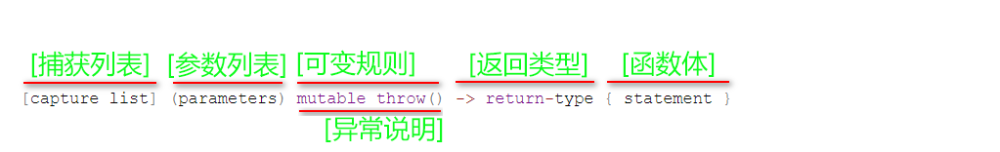

[TOC]

### lambda表达式，匿名表达式


不过值得注意的是，捕捉列表不允许变量重复传递。

mutable修饰符， 默认情况下Lambda函数总是一个const函数，mutable可以取消其常量性。在使用该修饰符时，参数列表不可省略（即使参数为空）。

值捕获创建了一个临时对象，拷贝了原变量的值，之后，这个临时变量与原来的变量再无任何瓜葛，lambda中操作的是这个临时变量。
而引用捕获，创建的是一个引用/指针，指向了原来的变量，lambda函数体中操作的就是变量本身。

* #### 隐式捕获
  将变量名写入捕获列表，为显式捕获。如果lambda中需要用到的非静态局部变量非常多，全部写入捕获列表，就会显得非常臃肿，有简便写法，即为隐式捕获。
  1、捕获列表的形式为"[=]"(值捕获)或者"[&]"(引用捕获);
  2、捕获列表里不能同时写"="和"&"，即"[=, &]"是非法的;
  3、隐式捕获可以和显式捕获搭配使用，但不能和同类型的显示捕获一起使用。即隐式值捕获只能搭配显式引用捕获，隐式引用捕获只能搭配显式值捕获。表现形式为："[=,&变量1,&变量2]"或者"[&,变量1,,变量2]"。

* #### 工作原理
  编译器会把一个Lambda表达式生成一个匿名类的匿名对象，并在类中重载函数调用运算符，实现了一个operator()方法。

* #### C++仿函数
  仿函数（functor）又称为函数对象（function object）是一个能行使函数功能的类。仿函数的语法几乎和我们普通的函数调用一样，不过作为仿函数的类，都必须重载operator()运算符，仿函数与Lamdba表达式的作用是一致的。

* #### 使用场景
  1. 短小不需要复用函数的场景，sort排序
  ```c
  // 对于比较大小的逻辑，使用lamdba不需要在重新定义一个函数
  sort(testdata.begin(), testdata.end(), [](int a, int b){ 
    return a > b; });
  ```
  2. for_each
  3. find_if
  4. remove_if
  5. 多线程
  6. 函数指针与function
  7. 作为函数的入参
  8. Qt

## 函数指针
形式1：返回类型(*函数名)(参数表) 
> char (*pFun)(int);
> //定义一个返回类型为char，参数为int的函数
> //从指针层面上理解该函数，即函数的函数名实际上是一个指针，
> //该指针指向函数在内存中的首地址
而typedef可以让函数指针更直观方便:
形式2：typedef  返回类型(*新类型)(参数表)
> 例：
> typedef char (*PTRFUN)(int);
> 以一个int为参数并返回char类型。后面就可以像使用int,char一样使用PTRFUN了

* typedef void*(*FUNC)(void*);参数是void*，返回类型也是void*的函数指针

## 函数指针 & 指针函数
指针函数定义：int *fun(int x); 函数指针定义：int (*f)(int); 

## define & typedef
typedef 是在**编译**过程中被解析的，而 #define 是在编译之前的**预处理时**被破解的； #define 只是对所定义的别名的简单替换，而 typedef 则要灵活的多。

## 指针数组 & 数组指针
int *p[4]; //定义一个指针数组，该数组中每个元素是一个指针，每个指针指向哪里就需要程序中后续再定义了。
int (*p)[4]; //定义一个数组指针，该指针指向含4个元素的一维数组（数组中每个元素是int型）。

区分int *p[n]; 和int (*p)[n]; **看运算符的优先级**
int *p[n]; 中，运算符[ ]优先级高，先与p结合成为一个数组，再由int*说明这是一个整型指针数组。
int (*p)[n]; 中( )优先级高，首先说明p是一个指针，指向一个整型的一维数组。

## 一个类成员调用另一个类成员