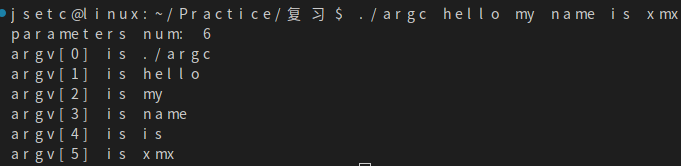

* ### 文件描述符(fd)
  * ### [参考](https://blog.csdn.net/yushuaigee/article/details/107883964)

  Linux系统中一切皆可以看成是文件，**文件又可分为：普通文件、目录文件、管道文件、堆栈文件、链接文件和设备文件**。在操作这些所谓的文件的时候，我们每操作一次就找一次名字，这会耗费大量的时间和效率。所以Linux中规定每一个文件对应一个索引，这样要操作文件的时候，我们直接找到索引就可以对其进行操作了。

  **文件描述符（file descriptor）就是内核为了高效管理这些已经被打开的文件所创建的索引**，其是一个非负整数（通常是小整数），用于指代被打开的文件，所有执行I/O操作的系统调用都通过文件描述符来实现。同时还规定系统刚刚启动的时候，0是标准输入，1是标准输出，2是标准错误。这意味着如果此时去打开一个新的文件，它的文件描述符会是3，再打开一个文件文件描述符就是4......

  Linux内核对所有打开的文件有一个文件描述符表格，里面存储了每个文件描述符作为索引与一个打开文件相对应的关系，简单理解就是下图这样一个数组，文件描述符（索引）就是文件描述符表这个数组的下标，数组的内容就是指向一个个打开的文件的指针。
  

* ### argc & argv
  argc是传入main函数的参数个数，包括程序本身。
  argv是传入main函数的参数列表，argv[0]是程序的名字。
  ```c
  #include <stdio.h>
  #include <stdlib.h>
  int main(int argc, const char* argv[])
  {
    printf("parameters num: %d\n", argc);
    for(int i = 0; i < argc;i ++)
    {
        printf("argv[%d] is %s\n", i, argv[i]);
    }

    return 0;
  }
  ```
  

  > 注意：
  1.main函数中的参数argc和argv可以换成别的名。
  2.argv是指向指针的指针，main函数的第二个参数“char *argv[]“也可以替换为 “char **argv“，两者是等价的。


* ### fopen与open的区别
  * #### 实质就是缓冲文件系统与非缓冲文件系统的区别
  * ##### 1.缓冲文件系统与非缓冲系统的区别
    **缓冲区文件系统（fopen）**：在内存为每个文件开辟一个缓存区，当执行读操作，从磁盘文件将数据读入内存缓冲区，装满后从内存缓冲区依次读取数据。写操作同理。内存缓冲区的大小影响着实际操作外存的次数，缓冲区越大，操作外存的次数越少，执行速度快，效率高。缓冲区大小由机器而定。
    借助文件结构体指针对文件管理，可读写字符串、格式化数据、二进制数据。
    **非缓冲文件系统(open)**：依赖操作系统功能对文件读写，不设文件结构体指针，只能读写二进制文件。
  * ##### 2.open属于低级IO，fopen属于高级IO
  * ##### 2.返回值
    **fopen**：是c库函数，返回一个指向文件结构的指针。
    **open**: 是系统调用，返回文件句柄，即文件在文件描述符表里的索引。
  * ##### 3.open是系统函数，不可移植；fopen是标准C函数，可移植
  * ##### 4.一般用fopen打开普通文件，open打开设备文件
  * ##### 5.最主要的区别是fopen在用户态下就有了缓存，在进行read和write的时候减少了用户态和内核态的切换，而open则每次都需要进行内核态和用户态的切换。
    表现为：
    &emsp;如果顺序访问文件，fopen比open快
    &emsp;如果随机访问文件，open比fopen快
    
   

* ### 各种头文件
  stdlib。。。