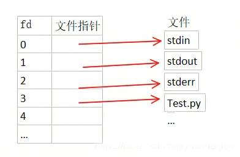
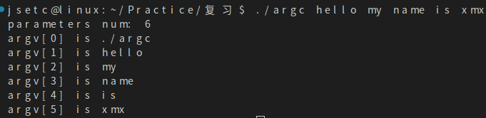

* ### 文件描述符(fd)
  * ### [参考](https://blog.csdn.net/yushuaigee/article/details/107883964)

  Linux系统中一切皆可以看成是文件，**文件又可分为：普通文件、目录文件、管道文件、堆栈文件、链接文件和设备文件**。在操作这些所谓的文件的时候，我们每操作一次就找一次名字，这会耗费大量的时间和效率。所以Linux中规定每一个文件对应一个索引，这样要操作文件的时候，我们直接找到索引就可以对其进行操作了。

  **文件描述符（file descriptor）就是内核为了高效管理这些已经被打开的文件所创建的索引**，其是一个非负整数（通常是小整数），用于指代被打开的文件，所有执行I/O操作的系统调用都通过文件描述符来实现。同时还规定系统刚刚启动的时候，0是标准输入，1是标准输出，2是标准错误。这意味着如果此时去打开一个新的文件，它的文件描述符会是3，再打开一个文件文件描述符就是4......

  Linux内核对所有打开的文件有一个文件描述符表格，里面存储了每个文件描述符作为索引与一个打开文件相对应的关系，简单理解就是下图这样一个数组，文件描述符（索引）就是文件描述符表这个数组的下标，数组的内容就是指向一个个打开的文件的指针。
  

* ### argc & argv
  argc是传入main函数的参数个数，包括程序本身。
  argv是传入main函数的参数列表，argv[0]是程序的名字。
  ```c
  #include <stdio.h>
  #include <stdlib.h>
  int main(int argc, const char* argv[])
  {
    printf("parameters num: %d\n", argc);
    for(int i = 0; i < argc;i ++)
    {
        printf("argv[%d] is %s\n", i, argv[i]);
    }

    return 0;
  }
  ```
  

  > 注意：
  1.main函数中的参数argc和argv可以换成别的名。
  2.argv是指向指针的指针，main函数的第二个参数“char *argv[]“也可以替换为 “char **argv“，两者是等价的。


* ### fopen与open的区别
  * #### 实质就是缓冲文件系统与非缓冲文件系统的区别
  * ##### 1.缓冲文件系统与非缓冲系统的区别
    **缓冲区文件系统（fopen）**：在内存为每个文件开辟一个缓存区，当执行读操作，从磁盘文件将数据读入内存缓冲区，装满后从内存缓冲区依次读取数据。写操作同理。内存缓冲区的大小影响着实际操作外存的次数，缓冲区越大，操作外存的次数越少，执行速度快，效率高。缓冲区大小由机器而定。
    借助文件结构体指针对文件管理，可读写字符串、格式化数据、二进制数据。
    **非缓冲文件系统(open)**：依赖操作系统功能对文件读写，不设文件结构体指针，只能读写二进制文件。
  * ##### 2.open属于低级IO，fopen属于高级IO
  * ##### 2.返回值
    **fopen**：是c库函数，返回一个指向文件结构的指针。
    **open**: 是系统调用，返回文件句柄，即文件在文件描述符表里的索引。
  * ##### 3.open是系统函数，不可移植；fopen是标准C函数，可移植
  * ##### 4.一般用fopen打开普通文件，open打开设备文件
  * ##### 5.最主要的区别是fopen在用户态下就有了缓存，在进行read和write的时候减少了用户态和内核态的切换，而open则每次都需要进行内核态和用户态的切换。
    表现为：
    &emsp;如果顺序访问文件，fopen比open快
    &emsp;如果随机访问文件，open比fopen快
    

* ### struct sockaddr 和 struct sockaddr_in
* 用来处理网络通信的地址
  * #### 1.sockaddr在在头文件#include <sys/socket.h>中定义，sockaddr的缺陷是：sa_data把目标地址和端口信息混在一起了，如下：
  ```c
  struct sockaddr {  
     sa_family_t sin_family;//地址族
     char sa_data[14]; //14字节，包含套接字中的目    标地址和端口信息               
     }; 
  ``` 
  * #### 2.sockaddr_in在头文件#include<netinet/in.h>或#include <arpa/inet.h>中定义，该结构体解决了sockaddr的缺陷，把port和addr 分开储存在两个变量中，如下：
  ```c
  struct sockaddr_in{
    sa_family_t sin_family;//地址族(Address Family )
    uint16_t sin_port;//16位TCP/UDP端口号
    struct in_addr sin_addr;//32位IP地址
    char sin_zero[8];//不使用
  };
  ```
  该结构体中提到的另一个结构体in_addr定义如下，它用来存放32位IP地址。
  ```c
  struct in_addr{
    In_addr_t s_addr;//32位IPv4地址
  };
  ``` 
  * #### 3.总结
  二者长度一样，都是16个字节，即占用的内存大小是一致的，因此可以互相转化。二者是并列结构，指向sockaddr_in结构的指针也可以指向sockaddr。

  sockaddr常用于bind、connect、recvfrom、sendto等函数的参数，指明地址信息，是一种通用的套接字地址。
  sockaddr_in 是internet环境下套接字的地址形式。所以在网络编程中我们会对sockaddr_in结构体进行操作，使用sockaddr_in来建立所需的信息，最后使用类型转化就可以了。一般先把sockaddr_in变量赋值后，强制类型转换后传入用sockaddr做参数的函数：sockaddr_in用于socket定义和赋值；sockaddr用于函数参数。

* ### sockaddr_in
  ockaddr_in是系统封装的一个结构体，具体包含了成员变量：sin_family、sin_addr、sin_zero。
  * sin_family主要用来定义是哪种地址族
  * sin_port主要用来保存端口号
  * sin_addr主要用来保存IP地址信息
  * sin_zero没有特殊含义
  sockadd的使用实例：
  ```c
  SOCKADDR_IN addr;//实例化一个addr来存放地址信息
  port = atoi(serv_port.GetBuffer(1));//将端口字符串转换为数字
  addr.sin_family = AF_INET;   //指定IP地址地址版本人为IPV4
  addr.sin_addr.S_un.S_addr = inet_addr(serv_addr.GetBuffer(1));//转换服务器ip地址
  addr.sin_port = ntohs(port);//存放端口信息
  ```

* ### 套接字
  socket，它是计算机之间进行通信的一种约定或一种方式。

  通过 socket 这种约定，一台计算机可以接收其他计算机的数据，也可以向其他计算机发送数据。
  socket 的典型应用就是 Web 服务器和浏览器：浏览器获取用户输入的 URL，向服务器发起请求，服务器分析接收到的 URL，将对应的网页内容返回给浏览器，浏览器再经过解析和渲染，就将文字、图片、视频等元素呈现给用户。
  例如我们每天浏览网页、QQ 聊天、收发 email 等等。

* ### 各种头文件
  stdlib。。。