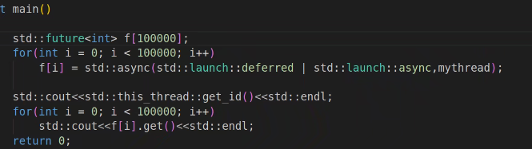
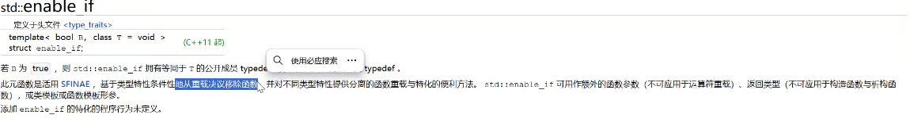
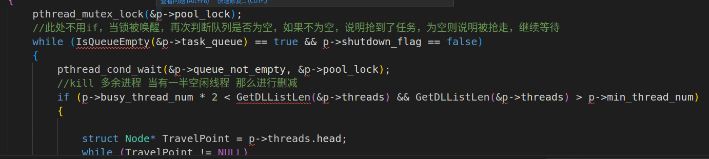
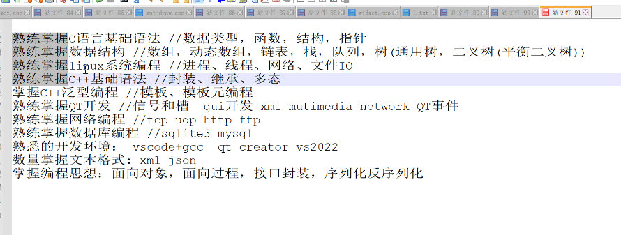
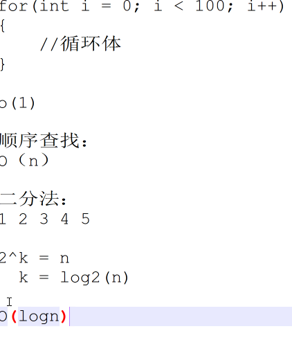

## 9.8
1.cpp和c的不同是编程思想不同

2.::域解析符

3.命名空间：值、函数

4.bool类型：true、false 非0就是1
            大小:1字节
            接口返回类型为bool

5.const
在C语言中通过指针间接影响const值;c++中const值无法修改。
```c
const int a = 1;
int *p = (int *)&a;`
```

表的优先级在内存之上
符号表在预处理阶段完成，define，const

6.constexpr常量表达式,修饰的变量有const属性，在编译器确定值。表达式左右两边都是常量。

7.inline内联函数
不要出现循环（也包括递归）、函数代码不要太长、逻辑太复杂，函数不能有取地址行为、函数内不能有静态变量

8.引用：变量的别名 &
int&：int类型的引用
引用必须初始化

9.函数重载
add(int, int)即_int_int_add
条件：参数类型不同，参数个数不同，参数顺序不同，无法用返回值类型区分重载

1）默认参数：
当参数没有被传入时，以默认值进行传入。
默认参数只能放在参数列表末尾。
默认参数会导致重载函数的歧义，最后别同时出现。

2）占位符
int add(int a, int b, int = 0)；

10.三目运算符
(a > b ? a : b)
c中作右值，c++中作左值是变量

11.类
protect、public、private

成员方法
函数类外定义,要声明那个类::
构造函数（函数名与类名相同，
         没有返回值，
         可以重载，
         系统给类分配默认无参空实现的构造函数，自定义了，就不会分配默认构造函数）
析构函数(对象被释放时自动调用)（函数名与类名相同，
                             没有返回值）
new & delect：堆空间操作，申请与释放一个对象。
              运算符关键字，无需头文件
              > student *stu1 = new student(100);
* 对象 = new 对象[];

this:指向本类对象

初始化列表：给不能正常赋值的对象赋初值
```c++
//h
const int grade;
//cpp
student::student(const char *name, int age):grade(16),age(age)
//可以区分成员变量和传入参数
```

12.static
静态成员变量：
在类里用static定义变量，则变量属于整个类，不独属于某一个类的对象

静态成员函数：
该函数可直接调用，不需要对象调用，不属于某一特定对象。也**没有this指针**，也不能访问非静态成员变量
```c++
//h
void static func();
//cpp
student::func();
```

* static关键字的作用：
修饰：
  C:局部变量（只初始化一次，全局保存）、全局变量（对其他文件隐藏）
  C++：成员变量（由该类成员共享，只初始化一次）、成员函数（该函数可直接调用，不需要对象调用，可以直接用类调用，只能访问静态成员变量）

struct & class
C：
1.struct没有访问权限的区别
2.struct不能放函数
3.struct不算新的数据类型定义，class是定义的新类型
C++：
默认的访问权限不同

用struct隐藏private的参数
```c++
//h
struct studentPrivate;
//class Student里定义
studentPrivate *p;
//cpp
struct studentPrivate
{
    int age;
    char *name;
    const int grade;

    studentPrivate():grade(16){};
    ~studentPrivate(){};
};
//构造函数调用p
student::student(const char *name, int age):p(new studentPrivate)
```


数据结构：单向数据库，双向链表

拷贝构造函数：为什么参数一定是引用
引用不会改变原内容

构造函数和拷贝构造函数调用同一个
所以每个对象都要申请空间new

C++也提供了默认复制构造函数

浅拷贝：调用的构造函数对于指针成员只进行地址的值复制，会造成二次释放问题。故要进行深拷贝：
拷贝时将指针的内存拷贝，而不是指针的值拷贝。


检查内存泄漏：new与delete配对，拷贝构造是深拷贝


## 9.10
1.C++之rvo和移动语义
移动语义：抢内存，目的是减少对象的拷贝
```c++
//类
demo();
demo GetCopy()
{
    demo temp = *this;
    return temp;
}
~demo();
//主函数
demo a;
demo c = a.GetCopy();//return抢走原内存（temp）内存，原对象内存不能再使用

//最后只进行两次构造析构
```

2.左值（有内存的对象）右值（只有值）
```c++
demo a;
demo b = a;//=相当于拷贝，a内存给b
```
右值引用：把一个左值变右值
```c++
demo(demo&& d);//右值引用，两个&

demo::demo(demo &&d)
{
    this->m = d.m;
    d.m = NULL;
    printf("move construction\n");
}

demo a;
demo d = std::move(a);//move变右值
```

3.std::cout & std::cin 标准输入输出流

4.匿名对象：作用域就一行,如demo(10)
```c++
//定义一个对象，想再输入值
    demo a = demo(10);
//结果只构造一次有参构造和析构
```

5.explicit：解决构造函数的隐式转换
```c++
explicit Integer(int a){}

integer a(10);
cout<<a.GetInteger()<<endl;
a = (20); //等于a = integer(a); 默认转换成匿名对象， 没有匹配符号在类外是不被允许的，故引用explicit
cout<<a.GetInteger()<<endl;
```


6.const三种用法：形参，返回值，函数
（1）const对（对象，会触发移动语义）返回值没有约束：
```c++
const integer GetInteger()
{
    return *this;
}
```
（2）但是const的约束力只在返回值是指针的时候有效
```c++
const int* GetInteger()
{
    return &num;
}
```
（3）常函数：const在函数最后加，修饰是是函数成员（私有成员不允许修改）,故在函数内不能对类的成员修改
```c++
void SetNum(int a)const
{
    num = a;//num是私有成员，会报错
}
```

7.运算符的重载：operator + 运算符 (符号：+ - .....)
```c++
//const virtualNumm& a;避免实参到形参的拷贝
virtualNum operator+(const virtualNum& a)//c需要写两个参数，c++使用this只用写入一个
{
    virtualNum c(0, 0);
    c.real = a.real + this->real;
    c.vir = a.vir + this->vir;
    return c;
}
```

重载可以直接使用运算符

8.友元函数 friend 允许访问私有成员
会破坏封装性，少用

友元类

友元关系是单向的。


> void不能连续等于
> 对象返回要多调用一次引用构造
> 调用不需要额外


单独的时候使用赋值重载
StdMyString str5 = "hhhhh"隐式转换


类型运算符


## 0912
1.new 对象数组
delete指针时 只会释放第一个对象
delete数组： delete []d;

对于基本类型的数组： new delete
自定义对象类的数组： new delete []p;

就地构造:
在调用构造函数开始时先调用就地构造.
```c++
class Line: public Point
{
private:
    Point end{0, 0};//就地构造
    Point start{0, 0};
}
```
委托构造：
在构造函数的**初始化列表**中调用别的构造函数。
```c++
Line(int x1, int y1, int x2, int y2):Point(x1, y1), end(Point(x2, y2)){}
Line(int x1, int y1, int x2, int y2):start(x1, y1), end(x2, y2){}
```
顺序：就地 > 委托 > 自己

继承：**代码复用**
公有，私有（父类所有成员到子类全变成私有成员，保护protected（该类和继承该类的类都可以访问，父类所有成员到子类变保护成员）
继承构造using：调用父类或者直接使用父类的构造函数

函数遮蔽：子类和父类函数相同优先调用子类，只是重名（重定义）
> 而重写函数名，类型，参数都要相同（重新定义和父类虚函数一模一样的函数的逻辑，函数主体）
解决办法：调用父类 或者域解析符
```c++
using Person::SetId;
void SetId(const float& id);
```

子类对象的创建和销毁顺序：父类构造->子类构造->子类析构->父类析构

多继承:子类对象在构造时调用的构造函数的顺序只与继承 有关，与调用顺序无关

菱形继承的参数的二义性-> **虚继承**：
在多重继承中，保证所有的派生类的父类副本都只有一份

**代码复用**：组合
把一个类的对象当成另一个对象的成员变量
```c++
class Rectangle:public Shape//组合
{
public:
    Rectangle(const Line& line1, const Line& line2):m_length(line1), m_width(line2){}//简洁，两个点两个线
    //Rectangle(const Line& line1, const Line& line2):Line(line1), m_endLine(line2){}//两个点（x,y),p一个线line
    double GetArea() override;
private:
    Line m_width;
    Line m_length;
}
```

计算图形面积
圆适合用继承：只需一个点
长方形更适合组合：

派生类无法重载基类的成员函数，如函数遮蔽，基类被屏蔽

多态：一个接口，多种状态
接口复用：就是函数复用
1.c++在父子类之间允许类型转换，有继承关系
2.父类指针指向子类对象，（通过指针调用派生类对象的虚函数）
> 指针是8个字节，智能指针能指向任何字节的对象
```c++
//用父类指针指向子类对象，调用子类的接口
Shape* s = &rect;
s->GetArea();
s = &c;
s->GetArea();
```
3.重写虚函数:
基类的指针只能访问从基类继承的成员，不能访问派生类新增的成员。

在构造函数中调用虚函数是无法实现多态的。

本类指针只能调用本类的方法，**虚函数可以调用子类方法**，父类加virtual，子类就不用加
```c++
virtual Shape::double GetArea();
```
> 可以用override检测子类重写虚函数名是否正确：double GetArea() override;

重载和重写区别：
1.重载发生在同一个类内或者全局，重写发生在父子之间
2.重载要求函数名相同，参数不同；重写是子类方法名和父类相同，则直接函数遮蔽
3.重载发生在编译阶段，重写体现在运行期间
4.重载被称为静多态，重写是动多态


服务器用多态

指针函数相当于回调函数


## 0914
向上转型（安全）：用子类对象去构造一个父类对象（将一个子类对象给一个父类对象）
该对象会调用父类方法
向下转型非法
//基类指针只会调用基类析构，不会调用子类析构
//父类指针调用子类析构：多态
Q:多态中，父类指针指向子类对象，释放父类指针只会调用父类析构，导致子类的指针成员无法释放，内存泄漏。
解决办法：**为了能调用子类的析构函数，把父类的析构函数声明为虚函数**
```c++
A *ptrA = new B(1, 2);  
ptrA->func();
delete ptrA;
```


重载 & 重定义（函数遮蔽） & 重写


纯虚函数:虚函数声明后面 = 0；
特点：
* 具有纯虚函数的类不能实例化对象，该类也称为抽象类（接口类）
* 继承于接口类的类，如果重写纯虚函数，仍为抽象类
* 重写**全部**纯虚函数的子类，可以实例化
作用：定义接口标准

计算立体图形的体积

不清楚类型可以用const char* type
Sort *CreateMySort(int type);变成Sort *CreateMySort(const char* type);

* 封装库：


封装动态库：在封装文件所在文件夹上打开终端
g++ -shared -fPIC StdMyString.cpp -o libStdMyString.so
sudo cp libStdMyString.so /usr/lib
sudo cp libStdMyString.h /usr/include

程序运行指令（多加-lStdMyString）：g++ sort.cpp -o sort -lStdMyString


Makefile伪命令


switch只对整型有效

本地化文件配置：不用修改代码

* 类的内存分布:


成员变量依旧遵循内存对齐和（struct相同），成员函数不占有类的内存
static被所有类的对象共享，所以不占用内存
const虽然是在表里查找，但还是占用内存，const相当于常量

class继承关系和struct的嵌套规则一样。

子类的对象中，先放父类成员，再放子类成员。
虚函数的实现方式：在对象内存中塞入虚函数指针，塞在对象的开头。
所有派生类只有一个

多态实现的原因：虚函数中含有虚函数指针，虚函数指针指向虚函数表。
虚函数表只有一个。
多个虚函数一个指针就够了。


虚函数占8个字节

虚继承的继承方式：虚继承指针 虚继承表
每多一次虚继承，多一个虚继承指针

带虚函数，带虚继承的实现方式

虚继承的内存顺序：虚函数指针 虚函数成员 虚继承指针 虚继承的成员


跟构造一样，父类在最后面

```c++
//解决以下代码出现 warning: format ‘%x’ expects argument of type ‘unsigned int’, but argument 2 has type ‘C*’ [-Wformat=]的原因
#include <iostream>
using namespace std;

class A
{
public:
    virtual void func(){}
    static void func2(){}

    // static int m_c;
    int m_a;
    // char m_b;
};

class B:virtual public A
{
public:
    virtual void fun3(){}
    int m_b;
};

class C:public B
{
public:
    int m_c;
};

int main()
{
    // cout<<sizeof(B)<<endl;
    // printf("m_a:%x m_b%x m_%x\n", &B::m_a, &B::m_b, &B::m_d);

    C c;
    cout<<sizeof(c)<<endl;
    printf("%x %x %x %x\n",&c, &c.m_a, &c.m_b, &c.m_c);

    return 0;
}
```

4种数据类型的转换方式
1.static_cast：静态转换：C语言的强制类型转换的替代品
* 基本数据类型的转换，基本数据类型的指针不能转
* 继承关系间的向上转型，无关系的类不能转换
* 可以用于void*（万能指针）和普通指针之间的转换
2.dynamic_cast
* 含有虚函数的父子之间转换
* 向下转型时如果非法，返回空指针nullptr
3.const_cast
const与非const之间的转换
```c++
int s = 10;
const int *a = &s;
int *b = const_cast<int*>(a);
*b = 20;
cout<<s<<endl;
```
4.reinterpret_cast重定义转换


泛型编程： 
模板：
1.当模板函数遇上普通函数的时候，优先调用普通函数。
add<int>(1, 2); 模板的显示调用
add(1, 2)；隐式调用
2.当模板函数能有更好的匹配时，优先选择模板。
3.普通函数有自动类型转换机制，模板没有，必须参数严格匹配。

显示的具体化：
template<> void Swap<Person>(Person& a, Person& b)
显示具体化优先于模板使用

类模板：
类模板的成员函数在类外定义时要当成函数模板去写，要显示声明函数模板类型：
TemplateClass<T>::TemplateClass(T a)

TemplateClass<int> a(10);显示指定类模板的类型

模板函数和模板类的定义都只能在头文件里。

重载了就不需要回调

typename:告诉编译器 T::Node是一个类型名，而不是一个静态成员变量

**移动语义**，右值构造
//StdMyString(const StdMyString&& str);

模板动态数组、模板栈、模板队列、模板数：模板通用树，模板平衡排序二叉树


## 0917
模板类的友元函数：友元函数的友元声明是不会共享类模板的声明的；
友元函数的声明模板变量的类型不能和类模板重名。

模板类的全特化：将一个类模板的所有模板变量都进行特殊化。
template<>
class Test<int, int>
类模板遇上全特化，优先调用全特化

模板类的偏特化：将一个类模板的部分模板变量进行特殊化
当类模板遇上偏特化，优先调用偏特化
template<typename T2>//模板函数的重载，不是偏特化，偏特化要再加一个int
即template<typename T2，int>

函数模板不需要偏特化，用重载函数可以实现对应的需求功能

STL：标准模板库
六大组件：容器、算法、迭代器、仿函数、适配器、空间适配器
不同容器的迭代器：


（1）vector:单端动态数组，连续空间

3种初始化：
```c++
//数组初始化
std::vector<int> a(arr,arr+5);
//迭代器初始化
std::vector<int> b(a.begin(), a.begin()+5);
//拷贝初始化
vector<int> c(b);
for(auto&value : b)
{
    cout<<" "<<endl;
}
```

base range for 

vector:[]：vector重载的中括号不会进行越界检测
       at：会抛出越界异常

vector的缺点

* emplace_back & psuh_back
a.emplace_back(StdMyString("world"));//移动语义，减少对象的拷贝，谨慎使用不然内存出错。
内存优化上：采用了就地构造（直接在容器内构造对象，不用拷贝一个复制品再使用）+强制类型转换。
效率上：省去拷贝构造

```c++
1.没有重载中括号就不能使用，a.size()的size是每次都要计算的
    for(int i = 0;i < a.size();i++)
    {
        std::cout<<a[i]<<" ";
    }
    std::cout<<std::endl;
2.迭代器访问，只要容器支持迭代器就可以使用（所有迭代器都支持）
    auto ite = a.begin();
    for(auto ite = a.begin();ite != a.end();ite++);//迭代器
    {
        std::cout<<*ite<<" ";
    }
    std::cout<<*a.begin()<<std::endl;
    std::cout<<*a.end()<<std::endl;
    std::cout<<std::endl;
3.访问速度最快，但无法计算个数，不知道下标和前后的值，最多返回当前值的引用
    for(auto&value : a)
    {
        std::cout<<value<<" ";
    }
```

（2）deque：很少用，双端动态数组，非连续数组，指针数组
用构造的代价换来复杂的空间计算
用vector不能满足头部操作的优化换来更大代价

（3）list：双向链表
list 由链表组成，不能随机读取，不能一次跨越两个
强大在随机存取，插入删除强
list迭代器不能+1
list没有重载下标[]

* std::list是顺序容器，但不是随机访问容器（仅有std::vector，C数组和c++11中的std::array是），可以从两端顺序访问，所以其迭代器只支持++和–这种双向的链式操作（c++11中的slist则只支持++）。如果想一次移动多个位置，也可以使用里的advance函数:
* ```c++
    auto it2 = list.begin();
    advance(it2, 2);
    cout<<*it2;
  ```

list优势：即它可以在序列已知的任何位置快速插入或删除元素 **（时间复杂度为O(1)）**。并且在 list 容器中**移动元素**，也比其它容器的效率高。
list缺点：它不能像 array 和 vector 那样，通过位置**直接访问元素**。举个例子，如果要访问 list 容器中的第 6 个元素，它不支持容器对象名[6]这种语法格式，正确的做法是从容器中第一个元素或最后一个元素开始**遍历**容器，直到找到该位置。

forward_list是C++11引入的新容器之一。它的底层是单向链表，引入它的主要目的是为了达到手写链表的性能。同时节省了部分内存空间。（只有一根指针）。


capacity容器扩容

vector<char>自带扩容重载

c++在Linux和wins上编码方式不同
wins上是GBK Linux上是UTF-8

在线聊天室


## 开源C++库的综合列表：
Redis
boost库：HTTP，Websocket
异端HTTP客户端库
QT库
release-OpenCV

(4)set：排序容器，值唯一
底层结构：平衡二叉树之红黑树

lower_bound(value)：输出数列中第一个大于等于Value的值的迭代器
upper_bound(value)：输出数列中第一个大于Value的值

(5)pair对组:

迭代器auto:
vector<pair<string, bool>>::iterator it = v.begin();
auto it2 = v.begin();//代替上面繁冗代码

(6)map容器：键值对列表 key,value
map[] = ;存在则更新数据，可以直接修改值
map.insert();存在键值则无视，不能修改值
insert_or_assign:插入或更新

利用operator()，可以根据大小排序
```c++
class Person
{
    public:
    string m_name;
    int m_age;
    Person(string name, int age)
    {
        m_name = name;
        m_age = age;
    }
}
class myComparePerson
{
    public:
    bool operator()(const Person &p1, const Person &p2) const//const可以修饰类成员函数
    {
        return p1.m_age>p2.m_age;
    }
};
//main
set<Person, myComparePerson> s;
```


## 0919
### 1.map 不能随便插入顺序，是要可以小于号比较的数值类型。字符串要**重载小于号**

### 2.tuple：元组容器，返回值有多个类型
make_tuple
```c++
tuple<int, double, std::string> t(1, 1.2, "hh");
auto t = make_tuple(1, 1.2, "hh");//优化，代价可读性下降
//tie 捆绑
std::tie(myint, mydouble, std::ignore) = t;
//可以用get取值：
get<0>(t)
```

### 3.any：万能匹配
可以把任意类型的数据放在any中，用的时候再any_cast出类型
any_cast转换类型不匹配，直接段错误
解决：
使用RTTI：运行时类型信息 void*
1）typeid：返回类型信息
```c++
// 判断pg指向的是否是ClassName类的对象
typeid(ClassName) == typeid(*pg)
```
2）type_info
补充：any可以表示任意类型，所以用不了多态，因为没有统一的接口
any优点：存放类型本身（无需存放指针而担心内存指向内容的生存），可以存放任何类型。
any缺点：用不了多态，用不了统一接口

野指针访问：内存已释放
异常处理:异常三个部分：抛出异常throw，检测异常try，捕获异常
try 尝试运行
{

}
catch 捕获异常
{

}

栈的解旋：在异常抛出后，被捕获之前，释放掉栈上的所有对象
堆呢

体系：纯虚函数->继承->多态

多态:引用（本质：指针对象）和父类指针指向子类对象


适配器：栈和队列，没有迭代器
栈要先取出栈元素，再抛出

约瑟夫环：队列，链表g 

临时对象就是匿名对象

算法库
函数对象（仿函数）：重载了（）的类

lambda表达式：匿名函数对象  适用于短小精悍代码
[]：捕获列表：捕获上文的变量和参数
变量名：捕获变量的值(右值，不能修改，修改要使用引用)
&变量名：捕获变量的引用
[&]：所有变量以引用形式进行捕获
[=]：所有变量以值的形式进行捕获

不能重复捕获

自动推导返回值类型,->表明返回类型
auto function = [&](int a, int b)->int{}

算法库
```c++
class Test1
{
public:
    void operator()(const int &a)
    {
        std::cout<<a<<std::endl;
    }

};

void Print(const int &x)
{
    std::cout<<x<<std::endl;
}
//main
std::vector<int> vec = {1, 2, 3, 4, 5, 6};
//三种表示方法
std::for_each(vec.begin(), vec.end(), Print);//一行遍历
std::for_each(vec.begin(), vec.end(), [](const int& x)       
        {std::cout<<x<<std::endl;});//一行遍历
std::for_each(vec.begin(), vec.end(), Test1());//一行遍历
```

回调三种方法：普通函数指针、函数对象、lambda表达式

vector:
reserve：预留空间，不构建对象，插入insert放入数据
resize：创建空间，构建对象

stable_partition：稳定版本，保存数列的原来的相对位置
partition：不稳定版本

? remove_if max

迭代器的使用：
迭代器失效的时机：（把迭代器当指针）
1.尾插：不一定导致迭代器失效。对于vector：重新分配空间，所有迭代器失效；不重新分配空间，除end外其他迭代器正常。那list呢，只要不动头，头部就不失效


2.中间插：


multiset和multimap：有序，允许重复的值

map红黑树
unordered_map：无序 ，底层由哈希表实现

function函数包装器
```c++
void func(int a, int b)
{
    std::cout<<"a = "<<a<<", b = "<<b<<std::endl;
}

std::function<void(int, int)> f = func;
```

成员与对象，只有绑定了成员才能使用
static静态成员函数没有this指针，无需指针可以调用。其他需指针
```c++
class Test
{
public:
    void operator()(int a, int b)
    {
        std::cout<<"a = "<<a<<", b = "<<b<<std::endl;
    }

    static void func1(int a, int b)
    {
        std::cout<<"a = "<<a<<", b = "<<b<<std::endl;
    }
};
std::function<void(int, int)> f = &Test::func1;
```

多种方法：
```c++
std::function<void(int, int)> f = func;

std::function<void(int, int)> f = Test();
std::function<void(int, int)> f = &Test::func1;

std::function<void(int, int)> f = [](int a, int b){
    std::cout<<"a = "<<a<<", b = "<<b<<std::endl;
};
```

bind绑定函数 ：（不带std的是在Tcp接口中使用）将一个函数和参数进行绑定，生成一个新的函数对象（改变函数的结构），该对象可以直接调用，但会自动填充参数。可以用于绑定成员函数。
std::placeholders::_1：占位符，函数调用时，参数会被自动填充到相应位置
```c++
auto f = std::bind(&Test::func2, &t, std::placeholders::_1, std::placeholders::_2);
auto f1 = std::bind(&Test::func2, &t, 100, std::placeholders::_2);
f1(1, 2);
```

C++ 内存管理
谁申请谁释放：类的内部而已

智能指针：管理堆上空间
* shared_ptr：共享指针。
（1）不要用原始指针去初始化智能指针，当原始指针去初始化智能指针，智能指针默认独占原始指针，当拷贝智能指针时，会造成错误。
（2）循环引用
```c++
std::shared_ptr<Test> p3(new Test);//官方初始化方式
p3->func();
//推荐以下初始化方式
std::shared_ptr<Test> p4 = std::make_shared<Test>();
```
use_count()：返回管理当前对象的不同 shared_ptr 实例（包含 this ）数量。若无管理对象，则返回 ​0​ 
* unique_ptr：独占指针，独占一块内存，会自动释放。独占体现在拷贝构造被删除，赋值运算符重载函数被删除
  ```c++
  //以下皆无法实现
  //拷贝
  std::unique_ptr<Test> p1;
  Test *p = new Test;
  std::unique_ptr<Test> p1(p);
  //重载
  std::unique_ptr<Test> p1;
  //p1 = p;赋值运算符重载函数被删除
  ```

  std::unique_ptr<Test> p1(p.get()); get是取出原始指针
  std::unique_ptr<Test> p2 = std::move(p);拥有独占的所有权，不能简单地将其复制给另一个独占指针。只能通过移动语义来转移所有权。

* weak_ptr：解决循环引用问题。指向shared_ptr的内存不会让引用计数器加1 ??不懂


move：左值强转右值，节省空间，为性能而生。
移动语义，允许直接转移对象的资产和属性的所有权，而在参数为右值时无需复制它们。
换一种说法就是，std::move() 将对象的状态或者所有权从一个对象转移到另一个对象，只是转移，没有内存的搬迁或者内存拷贝。
左值右值基本语法：
左值引用的基本语法：type &引用名 = 左值表达式；
右值引用的基本语法type &&引用名 = 右值表达式；
举例：
C++ 标准库使用比如vector::push_back 等这类函数时,会对参数的对象进行复制,连数据也会复制.这就会造成对象内存的额外创建, 本来原意是想把参数push_back进去就行了,通过std::move，可以避免不必要的拷贝操作。

内存自动释放原因：
含有引用计数器：计算智能指针指向内存的个数。
当没有指针指向内存，内存自动释放

一旦使用智能指针，就不要用裸指针

libevent 

h文件封装：sudo cp CSTL.h /usr/include/


## 0921
池化技术：减少系统调用的次数，减少进程的删减，提高程序性能

重载关键字new、delete
malloc、free
```c++
void* operator new(size_t size)
{
    std::cout << "operator new" << std::endl;
    return malloc(size);
}

void operator delete(void* p)
{
    std::cout<<"operator delete"<<std::endl;
    free(p);
}
```

防止一个对象在堆上被创建？
重载new私有化

new全局重载

重载new的重载：
```c++
void* operator new(size_t size, int a)//重载new的重载
{
    std::cout << "operator new" << std::endl;
    std::cout<<a<<std::endl;
    return malloc(size);
}

double *b = new(1) double(1.2);
delete b;
```

```c++
void* operator new(size_t size, char* p)//重载new的重载
{
    std::cout << "operator new" << std::endl;
    std::cout<<"cz"<<std::endl;
    return p;
}

char str[4] = {0};
int *a = new(str) int(2);//定位new，可以把new的对象指向（映射）到特定空间，a指向str的空间（大小为4
printf("str:%x a:%x\n", str, a);
std::cout<<*a<<std::endl;
```

对c来说，int和char的区别就是内存大小的区别

### 内存池：核心：重载new和delete，减少new和delete
无法通过内存池避免内存碎片问题

需要两条链表，内存块里的结点（小内存块）之间，内存块之间


头插
```c++
newBlock->next = memBlockHead;
memBlockHead = newBlock;
```


* 享元
* 进程、线程信号量

static int count;static最好用法：数数

嵌入式指针：
```c++
//共用体替代结构体，高阶写法，不占用空间，不过仅限内存池
union FreeNode
{
    char data[Node_Size];//可以随意指定字节大小
    FreeNode *next;
};
```

数组连续空间

伙伴算法：11页 

内存管理技术：new、智能指针、内存池
检测内存泄漏：内存池，编译器自带

vtune profile

stlfile.h

auto decltype
auto推导会忽略引用类型和前面的修饰关键字，decltype不会


decltype推导右值是普通类型，推导左值是引用类型
```c++
int a = 1;
int b = 2;
decltype(a+b) c = 0;//int是左值
decltype(a+=b) d = c;//返回a,是右值
```

decltype用于模板
返回值后置：不确定返回值类型，返回值依赖列表形参类别，放到前面无法识别，所以需后置
```c++
template<typename T1, typename T2>
// decltype(a + b) func(T1 a, T2 b)
auto func(T1 a, T2 b)->decltype(a + b){}
```

函数包装器

并发

#include <iostream>
#include <thread>

int main()
{
    auto func = []()
    {
        for(int i = 0; i < 100; i ++)
        {
            std::cout<<i<<std::endl;
        }
    };
    std::thread t1(func);

    //t1.join();
    //分离前判断是否可以回收，已回收的不能再回收
    if(t1.joinable())
    {
        t1.detach();        
    }


    auto func2 = []()
    {
        for(int i = 0; i < 25; i ++)
        {
            std::cout<<(char)(i + 'a')<<std::endl;
        }
    };
    std::thread t2(func2);

    t1.join();
    t2.join();

    return 0;
}

快排

线程间是竞争关系

死锁
std::lock 锁的封装：动态的释放锁
std::lock_guard<std::mutex> 把锁在构造函数里面上锁。在析构时解锁


原子类型：原子变量不需要加锁，保证线程安全
std::atomic<int>
原子变量：atomic和线程
多线程访问处理时，原子变量更新是及时的
对象有指针指向另一个内存，最好不要使用，不能保证另一个内存是否改变

临界值

线程安全的处理方式：锁（补充lock_guard） 信号量  临界值变为atomic

async：异步线程函数
std::launch::async；异步启动
std::launch::deferred；延时启动：同步任务，没有启用新的线程
好处：
```c++
int mythread()
{
    std::cout<<std::this_thread::get_id()<<std::endl;
    sleep(3);
    return 10;
}
//异步启动
auto f = std::async(std::launch::async, mythread);
std::cout<<std::this_thread::get_id()<<std::endl;
std::cout<<f.get()<<std::endl;//get会阻塞，等待异步任务

//延时启动， 是在get函数里启动任务，遇到get才启动
auto f1 = std::async(std::launch::deferred, mythread);
std::cout<<std::this_thread::get_id()<<std::endl;
std::cout<<f1.get()<<std::endl;//get会阻塞，等待异步任务
```
返回值：

std::launch::deferred | std::launch::async 启动策略：可以异步启动就异步执行，系统资源无法启动新线程时，使用同步任务。



同步、异步的区别：
同步不要出现临界值

base range for:for(auto &i : map)

final：修饰的类不能被继承，修饰的类是最终类。
default：声明函数是默认构造函数      A() = default;
delete：拷贝构造不被允许
```c++
A(const A&a) = delete;
void* operator new(size_t size) = delete;

A a;
A b(a);
A *c = new A;//不允许对象在堆上创建
```

enum class防止跨越做等值匹配

c++11特性：以上

c++14特性：
auto自动推导返回类型
auto func(auto i)//c++20可以推导形参列表

变量模板：
别名模板：

quoted：加双引号
头文件iomanip

excel解析库


## 0926
万能引用：&&，只在模板里万能。左值右值引用都能使用。注意不是右值引用
引用折叠：A && && = A &&
         A & && = A &
完美转发：解决参数传递时右值属性变成左值的问题
```c++
class Test
{
private:
    std::string name;

public:
    void Process(const std::string &value)//左值
    {
        std::cout<<"lvalue\n";
    }
    void Process(std::string &&value)//右值引用
    {
        std::cout<<"rvalue\n";
    }

    template<typename T>
    void callProcess(T &&param)
    {
        //Process(param);//param被当做参数再次调用的时候，默认传入的是左值，解决：完美转发
        Process(std::forward<T>(param));
    }
};

int main()
{
    Test t;
    std::string s = "wef";
    t.callProcess(s);
    t.callProcess(std::move(s));

    return 0;
}
```
返回值：
rvalue
rvalue
使用完美转发后：
lvalue
rvalue

c++萃取技术：
类型萃取：把类型信息提取出来，编译期
std::cout<<std::is_integral<int>::value<<std::endl;

vs偏特化


序列化Jason：文本化  内存数据变文本数据  如：结构体变字符串
反序列化：文本变成内存数据，例如：字符串变结构体


判断一个类中是否有某个函数

工具源 void_t

SFINAF：substitution failure is not an error。匹配失败不是错误。
只要模板有一个函数能匹配上就不会报错

enable_if



qt：gui core xml multimedia
跨平台特性
编辑器+编译套件：编译器+调试器
                gnc c/msvc/clang

Qmainwindow：菜单界面
Qwidget：窗口界面
Qdialog：对话框
.ui界面文件

ui文件不参与编译


信号和槽机制：相应的信号触发，运行槽函数
绑定信号和槽：connect（信号的发出者，发出的信号类型，信号的接受者，接受者执行的槽函数）；

listwidget：Item是节点

qt样式表：css
样式表：.qss

hover：鼠标悬停

qt对象树：vector<child> 父空间释放，子空间也自动释放

对话框Dialog
QMessageBox：消息对话框

自定义信号

链接动态库：pro 加上LIBS += -lStdMyString -lSqlite3


聊天室qt化
远程音乐播放器：文件服务器（大文件传输）：登录注册界面，远程发送歌单，远程下载歌曲，样式表的界面美化
客户端，Web化

Switch button

背景：
事件模块：
QEvent子类重写父类的虚对象
绘图事件 paintEvent update()：刷新图片
键盘事件 
鼠标事件

系统变量

QDialog：对话框

XML：可扩展性的标记语言
树形结构
Nodepad++
```xml
<?xml version="1.0" encoding="utf-8"?>
<根节点>
    <Port>  //element
        8888 //text
    </Port>
    <子节点>
        <数据 元素含义="年龄">10</数据> //文本节点
    <子节点>
</根节点>
```

Qt
minixml

树形结点：QDomNode

#### QDomDocument
```c++
//创建文件
QString StrFile = QString("../text.xml");
if(QFile::exists(StrFile))
{
    QFile::remove(StrFile);
}
```
```c++
//添加根节点
    QDomElement root=doc.createElement("library");
    doc.appendChild(root);
//添加第一个子节点及其子元素
//方式一：创建属性  其中键值对的值可以是各种类型
    QDomElement book=doc.createElement("book");
    book.setAttribute("id",1); 
//方式二：创建属性 值必须是字符串
    QDomAttr time=doc.createAttribute("time"); 
    time.setValue("2013/6/13");
    book.setAttributeNode(time);
    book.appendChild(title);
    title.appendChild(text);
//创建子元素    
    QDomElement title=doc.createElement("title"); 
    QDomText text; //设置括号标签中间的值
    text=doc.createTextNode("C++ primer");
    //从下往上添加
    author.appendChild(text);
    book.appendChild(author);
    root.appendChild(book);
```
Qt::UserRole
std::variant(C++17)当成any使用，在Userrole上存放东西


客户端登录可以选择服务器，并且下次启动时lineEdit是上次修改完的ip（存放在本地xml）
弹出界面输入ip和端口
自己设置服务器ip，点击生效


[图片旋转](https://blog.csdn.net/weixin_43676892/article/details/115509507?ops_request_misc=&request_id=&biz_id=102&utm_term=qt%E9%9F%B3%E4%B9%90%E6%92%AD%E6%94%BE%E5%9B%BE%E7%89%87%E6%9A%82%E5%81%9C%E6%97%8B%E8%BD%AC&utm_medium=distribute.pc_search_result.none-task-blog-2~all~sobaiduweb~default-0-115509507.142^v95^insert_down1&spm=1018.2226.3001.4187)

[颜色](https://blog.csdn.net/qhy1314520/article/details/119104897)
[颜色](https://blog.csdn.net/zy_heu/article/details/78952173)
[QWidget设置背景图片](https://blog.csdn.net/zhangliyun0393/article/details/117854776?spm=1001.2101.3001.6650.2&utm_medium=distribute.pc_relevant.none-task-blog-2%7Edefault%7EBlogCommendFromBaidu%7ERate-2-117854776-blog-105628878.235%5Ev38%5Epc_relevant_sort_base1&depth_1-utm_source=distribute.pc_relevant.none-task-blog-2%7Edefault%7EBlogCommendFromBaidu%7ERate-2-117854776-blog-105628878.235%5Ev38%5Epc_relevant_sort_base1&utm_relevant_index=3)


## 1010
CS架构：
服务器：**网络通信**（socket）+ **数据存储**（数据库登录注册sqlite3）
客户端：网络通信+人机交互（UI界面）





```
g++ -shared -fPIC StdSqlite.cpp StdTcp.cpp ThreadPool.cpp -o libMyStd.sov
sudo cp libMyStd.so /usr/lib
sudo cp StdSqlite.h StdTcp.h ThreadPool.h /usr/include
g++ main.cpp -o main -lMyStd -lsqlite3
```


**配置中心**：xml配置，创建xmlconfig类，创建map，从map获取配置

map在内存，只有保存在本地，才能持久保存


单例模式：
模块在一个进程中只能有一个实例，所有的上层模块只调用该实例。

**日志系统**：


## 1012
```xml
<配置>
    <字段>fromname</字段>
</配置>
```
"fromname:zhangsan"
序列化Json：JavaScript的对象标记法
本质：轻量级的文本格式
和xml比：更小

jsonobject:json对象
{

}

键值对：
"name":"zhangsan" 值：字符串,int,bool,null
数组：[]
```Json
{
    "name":"zhangsan",
    "age":22,
    "class":["chinese", "math"];
    //还可以嵌套
    "obj":
    {

    }
}
```

qt语句的劫持
echo hello >> 1.txt //重定向，可以改变log文件


1、c/ s架构socket Tcp
2、服务器:线程池技术、内存池、
3、客户端:xml本地化配置，QT前端界面，qss样式表，信号和槽
4、通信:通信数据格式:json:方式:加密opensscl
5、大文件传输
6、心跳检测方式
7、Linux上写库部署库

技能：
以上，加上Linux上写库部署库


http协议：超文本传输协议
请求+应答
状态码：
2xx：成功
3xx：请求的资源发生变动，需要重新请求
4xx：404：not found  403：被禁止
5xx：服务端出现问题 503：服务器繁忙，无法响应  502：网关错误
http字段：
host：主机域名 www.baidu.com
DNS：域名解析服务：域名解析成IP
内网穿透技术：搭建自己的服务器，个人云盘

content-length：服务器返回的文本长度
content-type：数据格式
content-encoding：数据的压缩方式

请求方式：
get：获取资源
Post：对发送的资源进行处理

TCP的CS是请求+应答，UDP无应答

https：加密的http

打包：
D:\qt\Qt5.12.2\5.12.2\mingw73_64>windeployqt C:\Users\Dell\Desktop\test\http.exe

openai


文心一言
吾爱破解
gitee

模板元编程
enum变struct

内存池GitHub
线程池
CS架构基于线程池+io复用并发聊天室


美化：


百度翻译，爬取豆瓣评论


## 1014
QT的主线程用来显示界面：UI线程
把耗时函数放在UI线程中运行会阻塞UI线程，让界面卡顿
耗时函数不应该放在主线程运行，放在子线程中运行

QThread类
真正的线程执行逻辑放在run函数（虚函数）中
进行多线程：重写run

视频：QT源对象系统

moveToThread：把对象放进线程进行处理

数据全部进行json序列化操作

魔塔

## 1017
多线程
1.继承QThread，重写run函数
2.继承QObject，moverothread
3.QThreadPool线程池
（1）.继承Qrunable，重写run函数

FTP协议：文件传输协议（支持多线程）
C/S架构的应用层协议
面向连接的，可靠的
真正连接传文件的端口：20
默认端口：21 传输命令
传文件的模式：
（1）主动模式：
（2）被动模式：

启用或关闭Windows功能->计算机管理->Internet information Server->添加ftp站点
ftp://192.168.1.16/

基于qt的ftp文件下载
1.单个文件下载
2.多个文件下载
3.同步下载

ftp的断点续传
需要Qftp模块

reply和manager不能在不同的线程中被创建

事件循环
子线程内使用信号和槽：手动开启事件循环
(1)QEventLoop eventLoop
(2)eventLoop.quit();
加在QNetworkReply::finished之后，退出事件
(3)eventLoop.exec();


## 1019
MySQL：服务器型数据库 mysql-server mysql-client
重量级 但安全

8.0.34

更改语言：
alter database student character set gbk; utf8
show create database student;
desc test;
修改类型：
alter table test modify name text;
alter table test rename to stu;
修改整个字段：
alter table stu change name stuname char;
添加字段：
alter table stu add age int;


mysql索引
在数据表的字段上添加的一种数据结构（二叉平衡树（b+）树
优点：提高检索效率
缺点：本质也是一张表，提高数据库的维护成本

使用场景：
1.主键和unique自动添加索引

事务：
对数据库的一系列操作，一起成功或者一起失败
特性：原子性、一致性。隔离性、持久性

事务操作：
1.mysql默认隐式事务
2.autocommit off：关闭自动提交
3.命令处理
4.提交commit 回滚rollback
5.start transaction
6.部分回滚操作 savepoint p1;打断点
              rollback to p1;
7.只读事务

事务的一些问题：
1.更新丢失：
2.脏读
3.重读
4.幻读
事务的隔离级别：
1.读未提交 read uncommited
2.读已提交 read commited
3.可重复读 repeatable read
4.串行化读 serializable

#include <mysql/mysql.h>
g++ mysql.cpp -o mysql -lmysqlclient


第三种池化：mysql的池化


<!--  -->

openai ftmmp
C++反射功能
封的库的作用

## 1024
池化作用：减少对象创建，减少系统IO调用

连接池：

不使用连接池：
mysql操作（TCP连接）：
1、TCP建立三次握手
2.mysql服务器认证
3.SQL语句执行
4.关闭mysql数据库
5.TCP四次挥手
缺点：
1.网络IO调用频繁
2.网络带宽使用率低
3.创建大量的临时对象

使用连接池：
初始化时就生成N个连接数据库的对象，之后的访问都从这些对象进行，只执行SQL语句。
实现思路：
1.初始化时创建N个对象，实施连接
2.获取对象进行操作
3.归还对象到连接池

stdmysql 里的private *p里的mysql进行了
浅拷贝，mysql内存二次释放

连接池为什么使用队列：
mysql会自动关闭连接，网络可能会不稳定导致数据库对象无法使用

什么时候使用了智能指针：
创建连接池stdmysqlpool时，对stdmysql 里的private *p里的mysql对象进行了浅拷贝，避免了mysql对象内存二次释放.
核心：用auto mysql = std::make_shared<StdMySql>(); 代替 StdMySql mysql;
三处修改：           
```c++
std::shared_ptr<StdMySqlPrivate> p;

StdMySql::StdMySql():p(std::make_shared<StdMySqlPrivate>())
{
    mysql_init(&p->mysql);
    p->isConnected = false;
}
//析构不用delete p；
StdMySql::~StdMySql()
{
    if(p->isConnected == true)
    {
        mysql_close(&p->mysql);
    }
    // delete p;
}
```
编译：加上  -lmysqlclient

StdMySql整合了StsMySqlPool

QT: StdMySql项目
LIBS += -lStdMySql -lmysqlclient


show和exec：
show：非模态对话框（显示之后窗体控制权会直接交出）：不会阻塞主界面
exec：模态对话框：直到关闭该界面才会移交窗体控制权


算法的时间复杂度：循环体的循环次数
空间复杂度：实施一个算法所需的额外空间

表示法：大O渐进法



排序算法


cd QtProject/BrainStorming/build-BSServer-Desktop_Qt_5_12_2_GCC_64bit-Debug


