[TOC]
# 课程来源于“B站尚硅谷”
# 一、Shell 概述
Shell是一个命令解释器，接收应用程序/用户命令，然后调用操作系统内核。它提供交互式的文本命令台。
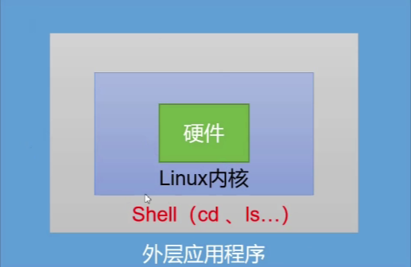
Shell还是一个功能强大的编程语言，易编写，易调试，灵活性强。

## 1.Linux提供的Shell解析器：
 > 切换root：sudo -u
 ```
 root@linux:~# cat /etc/shells
 ```
## 2.bash和sh的关系
 ```
 root@linux:~# ls -l /bin/ | grep sh
 root@linux:~# ls -l /bin/ | grep sh
 ```
## 3.默认解析器是：
 ```
 root@linux:~# echo $SHELL
 ```

# 二、Shell 脚本入门
## 1.脚本格式
脚本以 #!/bin/bash 开头（指定解析器）
* ### 基本命令
  ```
  查看权限：ll scripts/
  ```
## 2.第一个Shell脚本：hello.sh
* ### 案例实操
```
root@linux:~# touch hello.sh
root@linux:~# vim hello.sh
//写入内容
#!/bin/bash
echo "hello world"
```
* ### 3.脚本的常用执行方式
  * #### 1.采用bash或sh+脚本的相对路径或绝对路径（不用赋予脚本+x权限）
  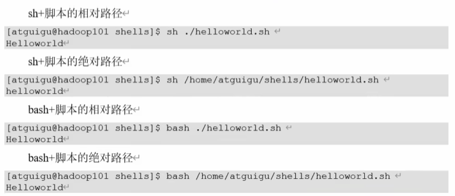
  ```
  root@linux:~# bash scripts/hello.sh
  root@linux:~# bash /root/scripts/hello.sh
  ```
  * #### 2.采用输入脚本的相对路径或绝对路径执行脚本（必须具有可执行+x权限）
  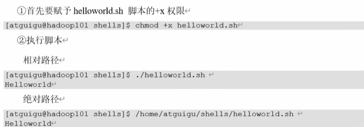

  > * ###  注意:
  >   第一种执行方式，本质是bash解析器帮你执行脚本，所以脚本本身不需要执行权限。第二种执行方法，本质是需要自己执行，所以需要执行权限。

  * ### 3.在脚本路径前加上“.”或者source
  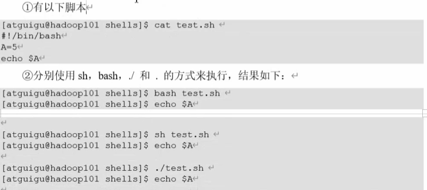
  

  > * ###  原因:
  > * 1.前两种方式都是在当前Shell中打开了一个子Shell来执行脚本内容，当脚本内容结束，则子Shell关闭，回到父Shell中。
  > * 2.第三种，可以使脚本内容在当前Shell里执行，而无需打开子Shell。
  > * 3.开子shell与不开子shell的区别在于，环境变量的继承关系，如在子shell中设置的当前变量，在父shell中不可见。

# 三、变量
## 1.系统预定义变量
* ### 1）常用环境变量
  $HOME、$PWD、$SHELL、$USER等。
* ### 2）案例
  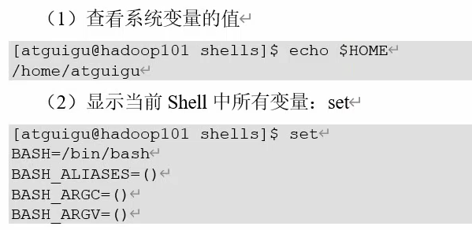
  也可以用**printenv HMOE**， 不用加$。
  ```
  set | grep 
  ```
## 2.自定义变量
* ### 1）基本语法
  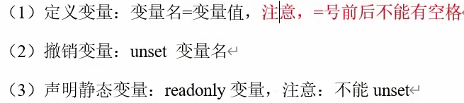
* ### 2）变量定义规则
  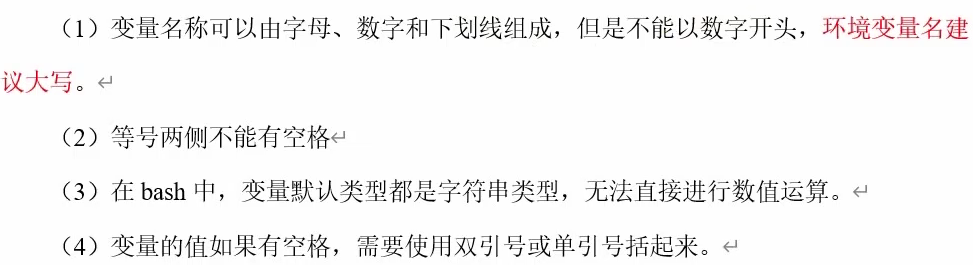
  ```
  set | grep my_var 显示所有变量
  ```

  > 单引号全部输出，双引号会辨识变量

  命令都是直接放在/bin目录下的，若想直接运行hello.sh文件，需把文件拷贝cp到bin目录下：
  ```
  # cp hello.sh /bin/
  # hello.sh
  ```
  查看可直接执行的路径：
  ```
  # echo $PATH
  ```

## 3.特殊变量
* ### 3.1 $n
* #### 1）基本语法
   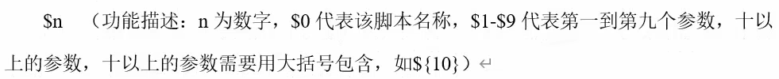
* #### 2）实例操作
  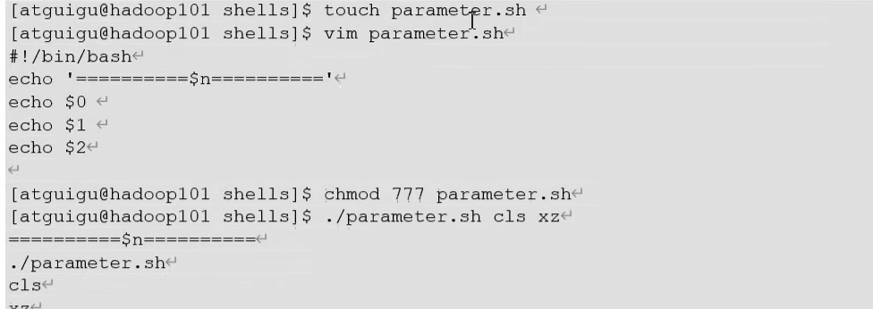
* ### 3.2 $#
* #### 1）基本语法
   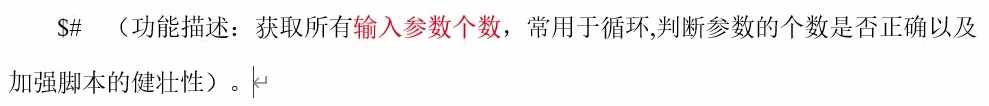
* #### 2）实例操作
   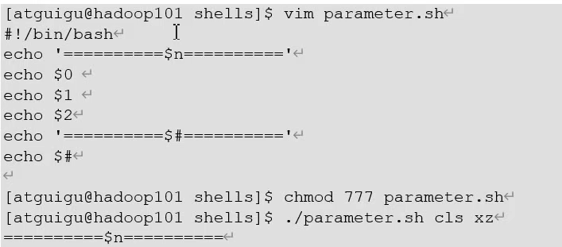
* ### 3.3 $@，￥*
* #### 1）基本语法
   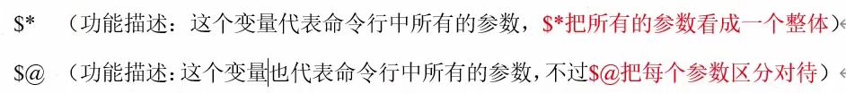
* ### 3.4 $？
* #### 1）基本语法
   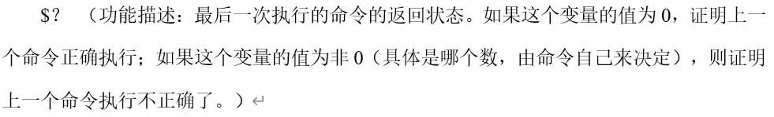
* #### 2）实例操作
  判断hello.sh脚本是否正确执行
  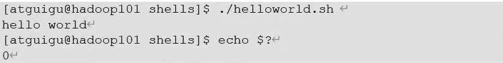

## 4.运算符
* ### 基本语法
  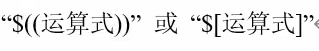
  > 也可以用expr，如expr 1 + 2，需要用空格，用乘法要进行转义\*.
  ```
  **两种表达**
  # a=`expr 5 \* 3`
  # a=$(expr 5\* 3)
  ```
## 5.条件判断
* ### 1）基本语法
  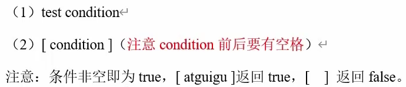
  ```
  (1)
  # test $a = Hello
  # echo $?
  (2)
  # [ $a = hello ]
  # echo $?
  ```
* ### 2）常用判断条件
  #### （1）两个整数比较
  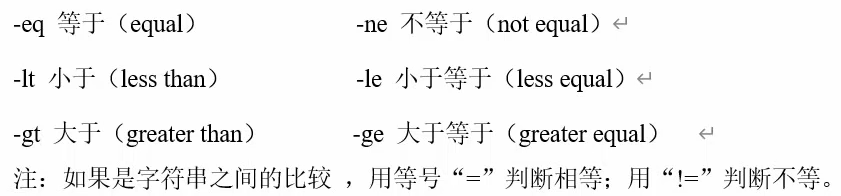
  #### （2）按照文件权限进行判断
  
  #### （3）按照文件类型进行判断
  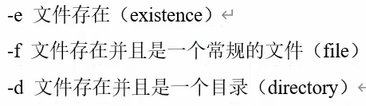
  > **补充：**
  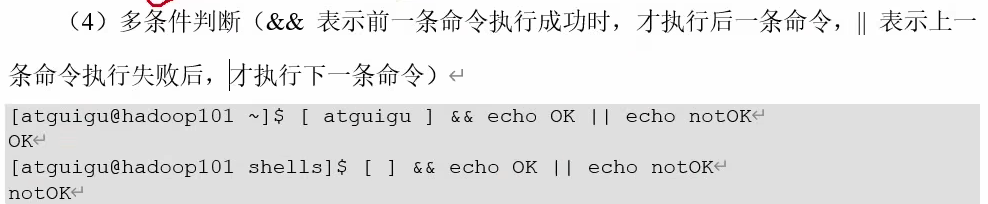

## 6.流程控制
* ### 1）基本语法
  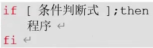
  > 拓展用法
  root@linux:/home# cd /home/; ls -l
  root@linux:/home# 
  
  **或者**
  
* #### （1）单分支
* #### （2）多分支
* #### （1）