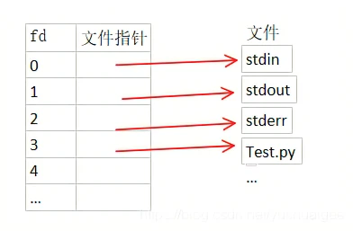

* ### 耦合度
  耦合度(Coupling)是对模块间关联程度的度量。耦合的强弱取决与模块间接口的复杂性、调用模块的方式以及通过界面传送数据的多少。

* ### BSP
  BSP是板级支持包，(board support package)是介于主板硬件和操作系统之间的一层，应该说是属于操作系统的一部分,主要目的是为了支持操作系统，使之能够更好的运行于硬件主板。
  BSP是相对于操作系统而言的，不 同的操作系统对应于不同定义形式的BSP,例如VxWorks的BSP和Linux的BSP相对于某一CPU来说尽管实现的功能一样，可是写法和接口定义是完全不同的，所以写BSP一定要按照该系统BSP的定义形式来写（BSP的编程过程 大多数是在某一个成型的BSP模板上进行修改），这样才能与上层OS保持正确的接口，良好的支持上层OS。

* ### 文件描述符(fd)
  * ### [参考](https://blog.csdn.net/yushuaigee/article/details/107883964)

  Linux系统中一切皆可以看成是文件，**文件又可分为：普通文件、目录文件、管道文件、堆栈文件、链接文件和设备文件**。在操作这些所谓的文件的时候，我们每操作一次就找一次名字，这会耗费大量的时间和效率。所以Linux中规定每一个文件对应一个索引，这样要操作文件的时候，我们直接找到索引就可以对其进行操作了。

  **文件描述符（file descriptor）就是内核为了高效管理这些已经被打开的文件所创建的索引**，其是一个非负整数（通常是小整数），用于指代被打开的文件，所有执行I/O操作的系统调用都通过文件描述符来实现。同时还规定系统刚刚启动的时候，0是标准输入，1是标准输出，2是标准错误。这意味着如果此时去打开一个新的文件，它的文件描述符会是3，再打开一个文件文件描述符就是4......

  Linux内核对所有打开的文件有一个文件描述符表格，里面存储了每个文件描述符作为索引与一个打开文件相对应的关系，简单理解就是下图这样一个数组，文件描述符（索引）就是文件描述符表这个数组的下标，数组的内容就是指向一个个打开的文件的指针。
  
