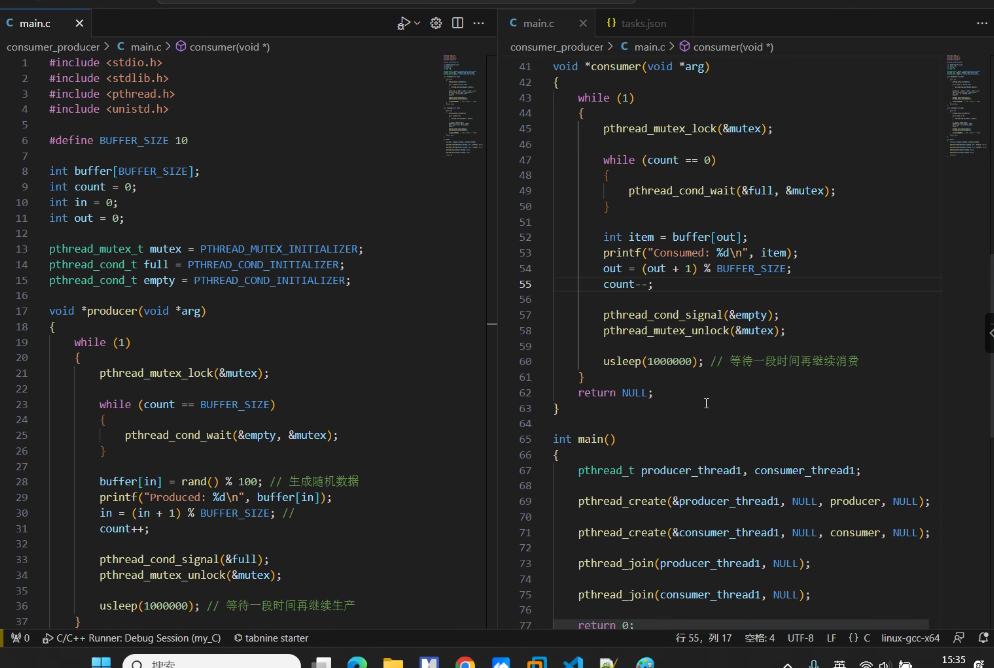

## 9.4
静态库（.a、.lib）和动态库（.so、.dll）
静态库：
先将代码编译成目标文件.o，加入-c；ar工具将目标文件打包成.a静态库文件。
创建：
> gcc -c 源文件.c
> ar rcs 静态库名 目标文件1 目标文件2
使用：
创建后，对全局变量和函数进行声明，编译时加上库文件
> gcc -o file file.c -L. -Iname

动态库：
先将代码编译成目标文件，加编译器选项-fpic（创建与地址无关的程序，为了能在多个应用程序间共享）；然后生成动态库，加链接器选项-shared。
创建：
> gcc -sahred -fPIC -o 库名.so 源文件.c
使用：
> gcc 源文件.c./库名.so -o 可执行文件名

## 9.5
gdb调试器使用：
运行：run （arg1 arg2）
设置断点：break 10，即第十行，或者b 10
查看变量值：print x
单步执行：step、s
下一步执行：next、n
> 单步执行和下一步执行区别：
> 在于当运行到函数时，下一步，会运行完函数并执行到当前代码页面的下一行，而单步，进入到函数入口处停下
观察堆栈：bt、backtrace
查看附件代码：list
查看全部的局部变量：info locals
ggg调试文件
gdb ggg进入调试
break 8第八行加断点
info b
b 4 第四行经断点
s初始值

## 9.6
文件类型
缓冲与return 0

feof()

指针常量&常量指针：
指针常量：值无法改变

常量变量存储区域：
常量在OR段

define定义接口true，false
const避免形参改变

stdlib属于进程里

## 9.7
void *start_routine(void *):返回指针的函数
函数名是函数的人口地址

&pthread传递地址才能修改值

cd /dev/input：查看输入设备

*num一级指针，&data=*num，&data为二级指针

void 万能值，可以接受int，char

### 接口 互斥 锁 条件变量 工厂模式
生产者消费者
两种条件：货架空OR满

## 911
1.int num; int *a; *a=num；那么*a和a都代表什么
在这段代码中，int num; 声明了一个整型变量 num，而 int *a; 声明了一个整型指针变量 a。
然后，*a=num; 将 num 的值赋给了 a 指针所指向的内存位置。
因此，*a 表达式表示 a 指针所指向的内存位置的值，即 num 的值。
而 a 表达式表示 a 指针本身的值，即指向 num 的内存地址。

2.const virtualNum& a 中的&
避免实参到形参的拷贝。
不用&，将会复制一个参数，而不是把原来的对象传入，会调用拷贝构造函数。
比如数据成员里有指针时，编译器提供的拷贝构造函数将会自动复制 一个指针，与原来的指针指向同一个地址，这样改变一个另一个也会改变

