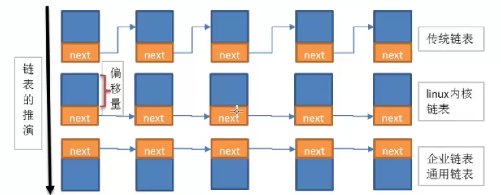
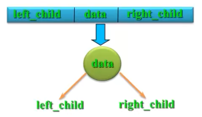
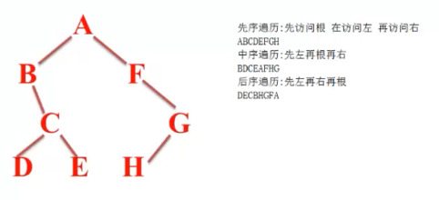

数据结构是算法需要处理问题的载体。

## 队列
* 操作受限的线性表，只允许在表的一端插入，在另一端删除。
* 将顺序队列臆造成一个环状空间即循环队列。当队首下标等于MAX_SIZE-1 后，再前进一个位置就设置为0，这可以通过取余操作完成。
* 此外，可以用链表添加操作受限也可以形成队列，但链式队列与顺序队列不同的是，链式队列原则上**没有队满**的时候。


大O表示法：
算法的时间复杂度：
* 只关注最高此项，最高次项不是1就舍去
* 时间复杂度是指最坏时间复杂度
* 只有常数项记作1,O(1)
空间复杂度：是使用的辅助空间的大小


## 2 线性表
### 2.1概念
是0个或者多个数据元素的有限序列（a0,a1,a2...an）
特性：
* 数据之间是有顺序的
* 数据元素个数是有限的
* 数据元素的类型必须相同
性质：
* a0为线性表第一个元素，只有一个后继
* an只有一个前驱
* 其他元素都有前驱后继
* 线性表能逐项访问和顺序存取
线性表的操作：
创建、销毁、清空、元素插入线性表、线性表删除元素、获取某个位置的元素、获取线性表长度

### 2.2线性表的顺序存储
是指用一段**地址连续**的存储单元依次存储线性表的数据元素

设计与实现：
#### 1.插入元素算法
* 判断线性表是否合法
* 判断插入位置是否合法
* 把最后一个元素到插入位置的元素后移一个位置
* 插入新元素
* 线性表长度加1

#### 2.优缺点：
优点：无需为线性表中的逻辑关系增加额外的空间，可以快速的获取表中合法位置。
缺点：插入和删除操作需要移动大量元素，当线性表长度变化较大时难以确定存储空间的容量。

* vector容器：
vector实现动态增加的方法：如果空间不足，那么vector会重新申请一块两倍大的空间，将原vector空间数据拷贝到新空间，释放旧空间，再把新元素插入新申请空间.

### 2.3线性表的链式存储
**不连续**的内存空间。没有容量的概念
单链表：每个节点只包含一个指针域。通过每个节点的指针域将线性表的数据元素按其逻辑次序链接起来。
* 表头结点：链表第一个节点，包含指向第一个数据元素的指针以及链表自身的一些信息。
* 数据结点：包含指向下一个数据元素的指针和数据元素的信息。
* 尾结点：其下一个元素指针为空，表示无后继。

链表的推演：
 

内核链表改进版本，即企业链表：（把指针域与数据域分开）
改进之后不需要考虑偏移量计算首地址与Node的偏移量，当前地址加上偏移量才能找到下一个next。
```c++
//.h文件
typedef struct LINKNODE{
    //void* data; 删去该行相当于链表中有挂钩
    struct LINKNODE* next;
}LinkNode;
//.c文件
typedef struct MyData{
    //加挂钩node,因为node里面有next（指向下一个首地址），可以使挂钩node串起来
    //而且node是首地址，所以只需把MyData*类型转变成LinkNode* 类型
    LinkNode node;
    char name[64];
    int age;
}MyData;
```
> * MyData data1；
> 数据类型是MyData类型，节点插入链表时转换为LinkNode*类型（只是把指针域串联），不会影响第一个next，需要打印数据时再把LinkNode*类型转换到MyData类型
> * LinkNode* node = （LinkNode*）&（data1）；
> 只需要使用LinkNode*把指针域串联

单向链表：指针域和数据域放在一起
企业链表：指针域和数据域分离

链表插入先插尾再插头


### 链式存储优点缺点
1.优点
无需一次性定义链表的容量
插入删除不需要移动数据
2.缺点
数据元素必须保存前后继的位置信息
获取指定数据的元素操作需要访问之前的元素
单链表严重依赖指针
数据元素必须额外包含一个指针域

## 循环链表
判断链表结尾：
第一方式：判断next是不是等于头结点
第二方式：size

约瑟夫问题-循环链表典型应用


## 树
结构特点：
* 非线性结构，有一个前驱，但可能有多个后继
* 树的定义有递归性，树中还有树
* 树可以为空，即节点个数为0


双亲表示法：
struct Node{
    int data;
    int parent;
};
孩子表示法：
struct ChildNode{
    int data;
    childNode*;
}
左孩子右兄弟表示法：二叉树

## 通用树
通用树的操作：
创建树
销毁树
清空树
插入结点到树中
删除结点
获取某个结点
获取根结点
获取树的高度
获取总结点数
获取树的度
输出树

树结构需要添加删除结点，数组存储是否灵活，每个子结点的子结点可以有多个，该如何存储：引出通用树。
由于链表可以无限扩展任意插入，可以用链表替代数组。
> 链表结构体定义指针域和表头结点
```c
//链表结点
typedef struct LINKNODE{
    void* data;//指向任何类型的数据
    struct LINKNODE* next;
}LinkNode;

//链表结构体
typedef struct LINKLIST{
    LinkNode* head;
    int size;
}LinkList;
```
通用树定义两个结构体，链表结点结构体和数结点结构体

### 二叉树
由一个根节点以及两颗互不相交的、分别称为左子树和右子树的二叉树组成。
逻辑结构：一对二
基本特征：
* 每个结点最多只有两颗子树；
* 左子树和右子树不能颠倒（有序树）。 
性质：
* 在二叉树的第i层上至多有2的i-1次方个结点
* 深度为k的二叉树至多有2dk次方-1个结点
* 对于任何一棵二叉树，若度为2的结点数有n2个，则叶子数（n0）必定为n2+1；即n0= n2+1；
* 具有n个结点的完全二叉树完全相同，第k层结点尽力靠左

满二叉树
完全二叉树：除最后一层，每一层的节点数均达最大值，在最后一层上只缺少右边的若干结点。（k-1层与满二叉树完全相同，第k层结点尽力靠左

二叉树的表示方法：
1）二叉链表示法：一般从根结点开始存储，访问树中的结点也只能从根开始。
存储结构：
结点数据类型定义：
typedef struct BiTNode{
    int data；
    struct BiNode* lchild， *rchild；//左右指针
}BiTNode.*BiTree；
2）三叉链表示法
存储结构：
每个节点有三个指针域，两个分别指向子节点（左右）还有一个指向父节点
结点数据类型定义：
typedef struct TriTNode{
    int data；
    struct BiNode* lchild， *rchild；//左右指针
    struct TriTNode *parent;
}TriTNode.*TriTree；

二叉树的遍历：
定义：按某条搜索线路遍访每个结点而不重复（即周游）
方法：先左后右：DLR（先序遍历）、LDR（中序遍历）、LRD（后序遍历）
