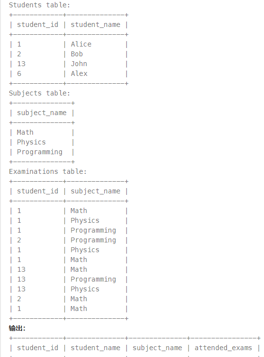
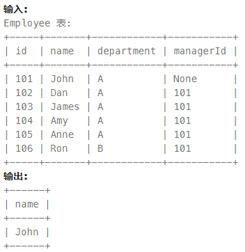

## 面试题
[mysql](https://blog.csdn.net/xiaofeng10330111/article/details/105361002)

## 力扣
1.197. 上升的温度


```sql
-- 方法一
select w2.id 
from Weather w1, Weather w2
where w2.recordDate = adddate(w1.recordDate, interval 1 day) and w2.temperature > w1.temperature;
-- 方法二 自连接
select w2.id 
from Weather w1, Weather w2 
where w2.temperature > w1.temperature and datediff(w2.recordDate, w1.recordDate) = 1;
```

2.1661. 每台机器的进程平均运行时间


```sql
-- 方法一 利用自连接 avg round
select t1.machine_id , round(avg(t2.timestamp - t1.timestamp), 3) processing_time
from Activity t1 , Activity t2 
where t1.machine_id = t2.machine_id and t1.process_id = t2.process_id and t1.activity_type = 'start' and t2.activity_type = 'end'
group by machine_id;

-- 方法二 avg round if
-- 不考虑process_id
-- avg里有4个数 所以除以了4 ，但是实际上avg里面的两组时间差只需要除以2
select machine_id, round(avg(if(activity_type = 'start', -timestamp, timestamp))*2, 3) processing_time
from Activity
group by machine_id;

-- 方法三 select里子查询
-- 找到开始状态记录，找出相同的结束状态时间点
select machine_id, round(avg((select timestamp from Activity where activity_type = 'end' and (machine_id, process_id) = (A.machine_id, A.process_id) - A.timestamp), 3))
from Activity A
where activity_type = 'start' order by machine_id;

-- 方法四 MAX(timestamp) - MIN(timestamp)
select machine_id, round(avg(time), 3) processing_time
from (select machine_id, max(timestamp) - min(timestamp) time from activity group by machine_id, process_id) A
group by machine_id;
```
知识点回顾：
流程函数 if(value, t, f) 如果value为true，则返回t，否则返回f


3.1280. 学生们参加各科测试的次数


获得两个表的所有组合，求笛卡尔积：使用交叉连接将表1的每一行与表2的每一行组合，从而得到所有可能组合。
```sql
select * from table1 cross join table2; 
```
左连接后，某一列的可能有null值，使用**IFNULL()**函数替换为0；

```sql
select stu.student_id, stu.student_name, sub.subject_name, ifnull(grouped.attended_exams, 0) attended_exams 
from Students stu
cross join Subjects sub
left join(
  select student_id, subject_name, count(*) as attended_exams 
  from Examinations
  group by student_id, subject_name
)grouped
on stu.student_id = grouped.student_id and sub.subject_name = grouped.subject_name 
order by stu.student_id , sub.subject_name;
```

left join之后，不能使用count(*)的情况：需要统计计数字段为null的情况，否则统计整行，右边为空的会统计为1.

解析：
1.求笛卡尔积
```sql
select
*
from `Students` as s1 
cross join `Subjects` as s2
```
2.分组统计
```sql
select
student_id, 
subject_name,
count(student_id) as attended_exams
from `Examinations`
group by student_id,subject_name
```
3.两部分连接
```sql
select
ss.student_id as student_id,
ss.student_name as student_name,
ss.subject_name as subject_name,
ifnull(e1.attended_exams, 0) as attended_exams
from
(
    select
    *
    from `Students` as s1 
    cross join `Subjects` as s2
) as ss
left join
(
    select
    student_id, 
    subject_name,
    count(student_id) as attended_exams
    from `Examinations`
    group by student_id,subject_name
) as e1
on ss.student_id = e1.student_id
and ss.subject_name = e1.subject_name
order by ss.student_id, ss.subject_name
```

4.570. 至少有5名直接下属的经理


1.哪些是至少5次出现的 group by + having
```sql
select managerId
from Employee
group by managerId
having count(managerId) >= 5;
```
2.子查询匹配
```sql
select managerId
from Employee
group by managerId
having count(managerId) >= 5
```