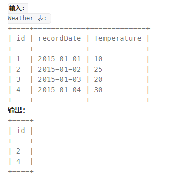
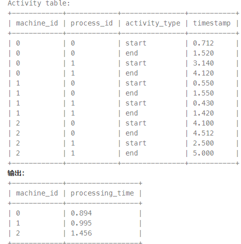

1.197. 上升的温度


```sql
-- 方法一
select w2.id 
from Weather w1, Weather w2
where w2.recordDate = adddate(w1.recordDate, interval 1 day) and w2.temperature > w1.temperature;
-- 方法二 自连接
select w2.id 
from Weather w1, Weather w2 
where w2.temperature > w1.temperature and datediff(w2.recordDate, w1.recordDate) = 1;
```

2.1661. 每台机器的进程平均运行时间


```sql
-- 方法一 利用自连接 avg round
select t1.machine_id , round(avg(t2.timestamp - t1.timestamp), 3) processing_time
from Activity t1 , Activity t2 
where t1.machine_id = t2.machine_id and t1.process_id = t2.process_id and t1.activity_type = 'start' and t2.activity_type = 'end'
group by machine_id;

-- 方法二 avg round if
-- 不考虑process_id
-- avg里有4个数 所以除以了4 ，但是实际上avg里面的两组时间差只需要除以2
select machine_id, round(avg(if(activity_type = 'start', -timestamp, timestamp))*2, 3) processing_time
from Activity
group by machine_id;

-- 方法三 select里子查询
-- 找到开始状态记录，找出相同的结束状态时间点
select machine_id, round(avg((select timestamp from Activity where activity_type = 'end' and (machine_id, process_id) = (A.machine_id, A.process_id) - A.timestamp), 3))
from Activity A
where activity_type = 'start' order by machine_id;

-- 方法四 MAX(timestamp) - MIN(timestamp)
select machine_id, round(avg(time), 3) processing_time
from (select machine_id, max(timestamp) - min(timestamp) time from activity group by machine_id, process_id) A
group by machine_id;
```
知识点回顾：
流程函数 if(value, t, f) 如果value为true，则返回t，否则返回f