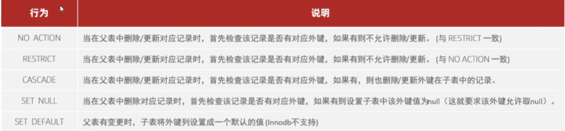
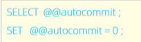

[TOC]
# 一、概述 P4
##  1.MySQL概述


## 2.关系型数据库


## 3.数据模型


# 二、SQL通用语法 P5 

## 1.SQL分类


##  2.DDL数据库操作 P6
* ### DDL-数据库操作

> 字符集utf8存储字长是3个字节，utf8mb4支持4个字节。

* ### DDL表操作 P7
  * **DDL-表操作-查询**  
    
  * **DDL-表操作-创建**  
    

  * **DDL-表操作-数据类型：**
  **主要分为**：数值类型、字符串类型、日期时间类型。
   
   
   

  * **DDL-表操作-修改：**
    添加字段：

修改数据类型：

修改字段名和字段类型：

删除字段：

修改表名：

删除表：

删除指定表，并重新创建：


##  3.DML 操作 P12
### DML插入 
1. 指定字段添加数据
 
1. 全部字段添加数据

1. 批量添加数据

  > 注意：字符串和日期数据在引号内。

### DML 更新删除 P13 
* 修改数据

* 修改数据

> 注意：delete语句不能删除一个字段的值（可以使用update）

##  4.DQL基础查询 P15
* ### DQL语法 


* ### 基本查询  
  1. 查询多个字段

  2. 设置别名

  ```
  select e.name ename, e.age e
  ```
  3. 去除重复记录


* ### 条件查询 
  1. 语法

  2. 条件


* ### 聚合函数 
  1. 介绍
    将一列数据作为一个整体，进行纵向计算。
  2. 常见聚合函数

  ```
  select count(*) from emp e where e.age >2 order by age asc;
  ```
   > 注意null值不参与所有聚合函数运算。
   > 注意，where 后面是不能跟 max（）的，因为max是聚合函数，但是可以使用having。

* ### 分组查询 
  1. 语法

  2. where与having的区别
   * 执行时不同：where是分组之前进行过滤，不满足where条件，不参与分组；而having是分组之后对结果进行过滤。
   * 判断条件不同：where不能对聚合函数进行判断，而having可以。
  > 注意：
  > * 执行顺序：where > 聚合函数 > having。
  > * 分组之后，查询的字段一般为聚合函数和分组字段，查询其他字段无任何意义。

* ### 排序查询 
  1. 语法

  2. 排序方式
     * ASE：升序（默认值）
     * DESC：降序
     > 注意：如果是多字段排序，当度过字段值相同时，才会根据第二个字段进行排序。

* ### 分页查询 
  1. 语法

   > 注意：
  > * 起始索引从0开始，起始索引 = （查询页码 - 1）* 每页显示记录数。
  > * 分页查询是数据库的方言，不同数据库有不同的实现，Mysql是LIMT。
  > * 如果查询的是第一页数据，起始索引可以省略，直接简写为limit 10。

* ### 执行顺序 
  * from > where > group by > having > select> order by > limit


##  5.DCL操作 P22 
* ### 管理用户 
  1. 查询用户

2  . 创建用户
  
      > 使用主机都可以访问，用%代替主机名。
  3. 修改用户密码

  4. 删除用户

   > 注意：
  > * 主机名可以是%。
  > * 这类SQL开发人员操作少，主要是DBA（Database Administer数据管理员）使用。

* ### 权限控制 
  常用：

1. 查询权限

1. 授予权限

1. 撤销权限

> 注意：
> * 多个权限之间使用逗号分隔。
> * 授权时，数据库名和表名可以用*代表所有。


#  三、函数 P27
## 1.字符串函数
**常用**：
```
select 函数
```


## 2.数值函数
**常用**：
```
select 函数
```
 

## 3.日期函数
**常用**：
```
select 函数
```


## 4.流程函数
**流程控制函数：可以在SQL语句中实现条件筛选，提高语句效率**
```
select 函数
```


#  四、约束 P32
## 1.概述
1. 概念
约束是作用于表中字段上的规则，用于限制存储在表中的数据。
1. 目的
保证数据库中数据的正确、有效和完整性。
1. 分类：
## 2.条件约束

> 注意：
> 约束是作用于表中字段上的，可以在创建表/修改表的时候添加约束。

* 案例：


## 3.外键约束
* 概念：用来让两张表的数据之间建立连接，从而保证数据的一致和完整性。
* 语法：
  * 添加外键：
  
  * 删除外键：
  
* 删除、更新行为：
  
  

## 4.小结


#  五、多表查询 P37
## 1.多表关系
* ###   概述
  项目开发中，在进行数据库表结构设计时，会根据业务需求及业务模块之间的关系，分析并设计表结构，由于业务之间相互关联，所以各个表结构之间也存在构造联系，主要分为三种：
  * 一对多/多对一
  * 多对多
  * 一对一
* ### 一对多
  
```
  create table student(
    id int auto_increment primary key comment '主键ID',
    name varchar(10) comment '姓名',
    no varchar(10) comment '学号'
) comment '学生表';
insert into student values (null, '黛绮丝', '2000100101'),(null, '谢逊', '2000100102'),(null, '殷天正', '2000100103'),(null, '韦一笑', '2000100104');

create table course(
    id int auto_increment primary key comment '主键ID',
    name varchar(10) comment '课程名称'
) comment '课程表';
insert into course values (null, 'Java'), (null, 'PHP'), (null , 'MySQL') , (null, 'Hadoop');

create table student_course
(
    id int auto_increment comment '主键' primary key,
    studentid int not null comment '学生ID',
    courseid  int not null comment '课程ID',
    constraint fk_studentid foreign key (studentid) references student(id),
    constraint fk_courseid foreign key (courseid) references course(id)
) comment '学生课程中间表';

insert into student_course values (null,1,1),(null,1,2),(null,1,3),(null,2,2),(null,2,3),(null,3,4);
```
* ### 多对多
* ### 一对一
  

## 2.多表查询
> 需消除多余的笛卡尔积
* ### 多表查询概述
  #### 分类
  
* ### 1.内连接
  **即查交集**
  语法：
    * 隐式内连接
  
    * 显式内连接
  
* ### 2.外连接
  #### 左外连接
  
  #### 右外连接
  
  
* ### 3.自连接
  #### 语法
  
  > 可以是内连接，也可以是外连接。
  ```
  -- 1. 查询员工 及其 所属领导的名字
  -- 表结构: emp
  select a.name , b.name from emp a , emp b where a.managerid = b.id;
  -- 2. 查询所有员工 emp 及其领导的名字 emp , 如果员工没有领导, 也需要查询出来
  -- 表结构: emp a , emp bselect e1.name,e2.name from emp e1 , emp e2 where e1.managerid = e2.id;
  select a.name, b.name from emp a left join emp b on a.managerid = b.id;
  ```
  


* ### 联合查询-union，union all 
  * union查询：就是把多次查询的结果合并起来，形成一个新的查询结果集。
  
  > 注意：
  > * 列数必须保持一致，字段类型也是。
  > * union all会把全部数据直接整合，union会对合并之后的数据去掉。

* ### 4.子查询
  * 概念：SQL语句中嵌套select语句，称为嵌套语句，又称子查询。
 
   * 根据子查询**结果**不同分为：
  
   * 根据子查询的**位置**分为：
  where之后、from之后、select之后。

  * #### 标量子查询
    概念：返回结果是单个值（数字、日期、字符串等），最简单的形式。
    常用操作符：= <> > >= < <=
    例子：查询销售部的所有员工
    ```
    select * from emp where dept_id = (select id from dept where name = '销售部');
    ```
  * #### 列子查询
    概念：返回结果是一列（可以是多行）。
    常用操作符：in，not in， any， some，all。
    
    例子：
    * 1.查询“销售部”和“市场部”的员工信息：
    ```
      select * from emp where dept_id in (select id from dept where name = '销售部' or name = '市场部');
    ```
    * 2.查询各自比市场部所有人都高的员工信息：
    ```
      select * from emp where salary > all(select salary from emp where dept_id = (select id from dept where name = '市场部'));
      select * from emp where (salary, managerid) = (select salary,managerid from emp where name = '张无忌');
    ```
    > 注意，where 后面是不能跟 max（）的，因为max是聚合函数，但是可以使用having。


  * #### 行子查询
    概念：返回结果是一行（可以是多列）。
    常用操作符：in，not in，=，<> 。
    例子：
      * 1.查询与张无忌的薪资及直属领导相同的员工信息：
      ```
        select * from emp where (salary, managerid) = (select salary,managerid from emp where name = '张无忌');
      ```
  * #### 表子查询
    概念：返回结果是多行多列。
    常用操作符：in 。
    例子：
      * 1.查询与张无忌的薪资及直属领导相同的员工信息：
      ```
        select * from emp where (salary, managerid) = (select salary,managerid from emp where name = '张无忌');
        select e.*, d.* from (select * from emp where entrydate > '2006-01-01') e left join dept d on e.dept_id = d.id；
      ```
      * 2.查询入职日期在2006-01-01之后的员工信息，及其部门信息：
      ```
        select e.*, d.* from (select * from emp where entrydate > '2006-01-01') e left join dept d on e.dept_id = d.id；
      ```
* ### 5.多表查询案例
    ```
    -- 1. 查询员工的姓名、年龄、职位、部门信息 （隐式内连接）
  -- 表: emp , dept
  -- 连接条件: emp.dept_id = dept.id

  select e.name , e.age , e.job , d.name from emp e , dept d where e.dept_id = d.id;


  -- 2. 查询年龄小于30岁的员工的姓名、年龄、职位、部门信息（显式内连接）
  -- 表: emp , dept
  -- 连接条件: emp.dept_id = dept.id

  select e.name , e.age , e.job , d.name from emp e inner join dept d on e.dept_id = d.id where e.age < 30;


  -- 3. 查询拥有员工的部门ID、部门名称
  -- 表: emp , dept
  -- 连接条件: emp.dept_id = dept.id

  select distinct d.id , d.name from emp e , dept d where e.dept_id = d.id;


  -- 4. 查询所有年龄大于40岁的员工, 及其归属的部门名称; 如果员工没有分配部门, 也需要展示出来
  -- 表: emp , dept
  -- 连接条件: emp.dept_id = dept.id
  -- 外连接

  select e.*, d.name from emp e left join dept d on e.dept_id = d.id where e.age > 40 ;


  -- 5. 查询所有员工的工资等级
  -- 表: emp , salgrade
  -- 连接条件 : emp.salary >= salgrade.losal and emp.salary <= salgrade.hisal

  select e.* , s.grade , s.losal, s.hisal from emp e , salgrade s where e.salary >= s.losal and e.salary <= s.hisal;

  select e.* , s.grade , s.losal, s.hisal from emp e , salgrade s where e.salary between s.losal and s.hisal;


  -- 6. 查询 "研发部" 所有员工的信息及 工资等级
  -- 表: emp , salgrade , dept
  -- 连接条件 : emp.salary between salgrade.losal and salgrade.hisal , emp.dept_id = dept.id
  -- 查询条件 : dept.name = '研发部'

  select e.* , s.grade from emp e , dept d , salgrade s where e.dept_id = d.id and ( e.salary between s.losal and s.hisal ) and d.name = '研发部';


  -- 7. 查询 "研发部" 员工的平均工资
  -- 表: emp , dept
  -- 连接条件 :  emp.dept_id = dept.id

  select avg(e.salary) from emp e, dept d where e.dept_id = d.id and d.name = '研发部';

  -- 8. 查询工资比 "灭绝" 高的员工信息。
  -- a. 查询 "灭绝" 的薪资
  select salary from emp where name = '灭绝';

  -- b. 查询比她工资高的员工数据
  select * from emp where salary > ( select salary from emp where name = '灭绝' );


  -- 9. 查询比平均薪资高的员工信息
  -- a. 查询员工的平均薪资
  select avg(salary) from emp;

  -- b. 查询比平均薪资高的员工信息
  select * from emp where salary > ( select avg(salary) from emp );

  -- 10. 查询低于本部门平均工资的员工信息
  -- a. 查询指定部门平均薪资  1
  select avg(e1.salary) from emp e1 where e1.dept_id = 1;
  select avg(e1.salary) from emp e1 where e1.dept_id = 2;

  -- b. 查询低于本部门平均工资的员工信息
  select * from emp e2 where e2.salary < ( select avg(e1.salary) from emp e1 where e1.dept_id = e2.dept_id );


  -- 11. 查询所有的部门信息, 并统计部门的员工人数
  select d.id, d.name , ( select count(*) from emp e where e.dept_id = d.id ) '人数' from dept d;

  select count(*) from emp where dept_id = 1;
  select d.* , count(*) from dept d left join emp e on e.dept_id = d.id group by d.id;


  -- 12. 查询所有学生的选课情况, 展示出学生名称, 学号, 课程名称
  -- 表: student , course , student_course
  -- 连接条件: student.id = student_course.studentid , course.id = student_course.courseid

  select s.name , s.no , c.name from student s , student_course sc , course c where s.id = sc.studentid and sc.courseid = c.id ;
  ```


# 六、事务
## 1.简介

## 2.事务操作
* ### 1. 方式一
  * #### 查看/设置事务提交方式
    
    ```
    set @@autocommit = 0; -- 设置为手动提交
    ```
  * #### 提交事务
    
  * #### 回滚事务
    
* ### 2. 方式二
  * #### 开启事务
    
  * #### 提交事务
    
  * #### 回滚事务
    
## 3.事务四大特性
* ### 面试考
  
## 4.并发事务问题
   
## 5.事务管理级别
* ### 事务隔离级别
  


# 完结撒花，历时两天 5/12/2023——5/14/2023