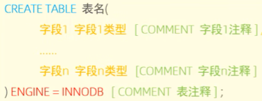

# 目录
[TOC]
****
# 一、存储引擎
## 1. MySQL体系结构


## 2. 简介
存储引擎就是存储数据、建立索引、更新/查询数据等技术的实现方式。存储引擎是基于表的，而不是基于库的，所以存储引擎也可以被称为表类型。
查询建表语句：
```q
show create table account;
```
查询当前数据库支持的存储引擎：
```q
show engines;
```
在存储表式，指定存储引擎


## 3.存储引擎特点
* ### InnoDB
  
* ### 逻辑存储结构
  

# 二、索引

# 三、SQL优化

# 四、视图/存储过程/触发器

# 五、锁

# 六、InnoDB引擎

# 七、MySQL管理