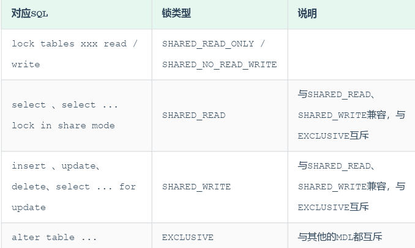

# 目录
[TOC]
****
# 一、存储引擎
## 1. MySQL体系结构


## 2. 简介
存储引擎就是存储数据、建立索引、更新/查询数据等技术的实现方式。存储引擎是基于表的，而不是基于库的，所以存储引擎也可以被称为表类型。
查询建表语句：
```q
show create table account;
```
查询当前数据库支持的存储引擎：
```q
show engines;
```
在存储表式，指定存储引擎


## 3.存储引擎特点
* ### InnoDB
  

  

  #### 逻辑存储结构
  

* ### MyISAM
  ](${currentFileDir}/20230711112217.png)
* ### MyISAM
  

## 总结
体系结构：连接层、服务层、引擎层、存储层

## 存储引擎选择


# 二、索引
xshell上传文件到服务器：rz -y
sudo alien -r

## 1.索引概述
索引是帮助MySQL高效获取数据的数据结构(有序)。在数据之外，数据库系统还维护着满足特定查找算法的数据结构，这些数据结构以某种方式引用（指向）数据，这样就可以在这些数据结构上实现高级查找算法，这种数据结构就是索引。
## 2.索引结构
> 数据格式化网站 
###
#### 1.B-tree（多路平衡查找树） 
以一颗最大度数为5（5阶）的b-tree为例（每个节点最多存储4个key，5个指针）：
> 树的度数指的是一个节点的子节点个数。
 

#### 2.二叉树
选择二叉树作为索引结构存在的缺点：
* 顺序插入时，会形成一个链表，查询性能大大降低
* 大数据量情况下，层级较深，检索速度慢

> 若选择红黑树？
> 红黑树是一颗自平衡二叉树，即使顺序插入数据，最终形成的数据结构也是一颗平衡的二叉树。

#### 3.B+tree
以一颗最大度数为4的b+tree为例：


> 与B-Tree区别：
> * 所有数据都会出现在叶子节点上
> * 叶子节点形成一个单向链表

* #### MySQL索引数据结构对经典B+Tree的优化
  增加一个指向相邻叶子节点的链表指针，形成有顺序指针的B+Tree，提高区间访问性能。
  

InnoDB存储引擎结构：表空间、段、区、页（默认16k）、行

### 2.Hash哈希索引
哈希索引就是采用一定的hash算法，将键值换算成新的Hash值，映射到对应的槽位上，然后存储在hash表中。
如果两个（或多个）键值，映射到同一槽位上，就产生了hash冲突，可以通过链表解决。


> 特点
> * hash索引只能用于对等比较（=，in），不支持范围查询（between，>，<）
> * 无法利用索引完成排序操作
> * 查询效率高，一般一次检索就行，效率通常高于B+Tree索引
### 3.思考


## 3.索引分类
1.分类


2.聚集索引&二级索引
根据存储形式分类：


聚集索引选取规则:
如果存在主键，主键索引就是聚集索引。
如果不存在主键，将使用第一个唯一（UNIQUE）索引作为聚集索引。
如果表没有主键，或没有合适的唯一索引，则InnoDB会自动生成一个rowid作为隐藏的聚集索引。

聚集索引的叶子节点下挂的是这一行的数据。
二级索引的叶子节点下挂的是该字段值对应的主键值。

回表查询：
这种先到二级索引中查找数据，找到主键值，然后再到聚集索引中根据主键值，获取数据的方式，就称之为回表查询。
## 4.索引语法
创建索引：


单列索引与联合索引（取决于括号名字数量）
查看索引：


删除索引：


联合索引：


## 5.SQL性能分析
SQL执行频率

> 如果是以增删改为主，我们可以考虑不对其进行索引的优化。如果是以查询为主，那么就要虑对数据库的索引进行优化了。

慢查询日志


profile详情


explain执行计划


## 6.索引使用
/G:查询结果换行
1.验证索引效率：
在未建立索引之前，执行以下查看SQL耗时：


针对字段创建索引：


再次执行相同语句查看耗时：


2.最左前缀法则


3.范围查询
联合索引中，出现范围查询，范围查询右侧的列索引失效

4.索引失败情况
索引列运算：
不要在索引列上进行运算操作，索引将失效
字符串不加引号：
字符串类型字段不使用时，不加引号，索引失效
模糊查询：
在like模糊查询中，在关键字后加%，索引生效，加在前面则索引失效
or连接条件：
用or分割开的条件，如果or之前的条件有索引，而后面没有，那么涉及到的索引都不会被用到。只有两侧都有才能生效。
数据发布影响：
如果MySQL评估使用索引比全表慢，则不使用索引。
SQL提示：
use、force、ignore
> explain select * from tb_user use index(idx_user_pro) where profession = '软件工程';
覆盖索引：
尽量使用覆盖索引，减少select *。那么什么是覆盖索引呢？覆盖索引是指查询使用了索引，并且需要返回的列，在该索引中已经全部能够找到。
4.7.前缀索引：
当字段类型为字符串（varchar，text，longtext等）时，有时候需要索引很长的字符串，这会让索引变得很大，查询时，浪费大量的磁IO，影响查询效率。此时可以只将字符串的一部分前缀，建立索引，这样可以大大节约索引空间，从而提高索引效率。

单列索引与联合索引：
单列索引：
即一个索引只包含单个列。
联合索引：
即一个索引包含了多个列。（创建时要考虑顺序，最左前缀法则），无需回表查询。

## 7.索引设计原则
1）.针对于数据量较大，且查询比较频繁的表建立索引。
2）.针对于常作为查询条件（where）、排序（order by）、分组（group by）操作的字段建立索引。
3）.尽量选择区分度高的列作为索引，尽量建立唯一索引，区分度越高，使用索引的效率越高。
4）.如果是字符串类型的字段，字段的长度较长，可以针对于字段的特点，建立前缀索引。
5）.尽量使用联合索引，减少单列索引，查询时，联合索引很多时候可以覆盖索引，节省存储空间，避免回表，提高查询效率。
6）.要控制索引的数量，索引并不是多多益善，索引越多，维护索引结构的代价也就越大，会影响增删改的效率。
7）.如果索引列不能存储NULL值，请在创建表时使用NOT NULL约束它。当优化器知道每列是否包含NULL值时，它可以更好地确定哪个索引最有效地用于查询。

# 三、SQL优化
1.插入数据
如需大批量插入数据，使用load指令插入：


> 切换到root用rz上传文件，pwd查看路径

2.主键优化
主键顺序插入性能高于乱序插入。
乱序插入可能产生页分裂

UID：唯一设备标识。
UUID：通用唯一识别码。
SonwFlake（雪花算法）：还包含时间戳，机器序列

1）数据组织方式
InnoDB存储引擎中，表数据都是根据主键顺序组织存放，该存储方式的表称为索引组织表。
2）页分类
乱序插入产生
每页包含2-n行数据，一行数据过大容易溢出。
3）页合并
页中的删除记录达到页的50%，InnoDB会寻找最靠近的页（前后都行）看是否可以将两个页合并以优化空间使用。
4）索引设计原则
满足业务需求的情况下，尽量降低主键长度。


3.order by优化
创建联合索引，只使用index没有filesort的前提是使用覆盖索引（只查询索引的内容），且满足最左前缀法则。
A.根据排序字段建立合适的索引，多字段排序时，也遵循最左前缀法则。
B.尽量使用覆盖索引。
C.多字段排序,一个升序一个降序，此时需要注意联合索引在创建时的规则（ASC/DESC）。
D.如果不可避免的出现filesort，大数据量排序时，可以适当增大排序缓冲区大小sort_buffer_size(默认256k)。


4.group by优化
在分组操作中，我们需要通过以下两点进行优化，以提升性能：
A.在分组操作时，可以通过索引来提高效率。
B.分组操作时，索引的使用也是满足最左前缀法则的。

5.limit优化
在数据量比较大时，如果进行limit分页查询，在查询时，越往后，分页查询效率越低。
优化思路:
一般分页查询时，通过创建覆盖索引能够比较好地提高性能，可以通过覆盖索引加子查询形式进行优化。


6.count优化


按照效率排序的话，count(字段)< count(主键id) < count(1) ≈ count(*)，所以尽量使用count(*)。

7.update优化
InnoDB的行锁是针对索引加的锁，不是针对记录加的锁,并且该索引不能失效，否则会从行锁升级为表锁。

# 四、视图/存储过程/触发器
1.视图
1）视图（View）是一种虚拟存在的表。视图中的数据并不在数据库中实际存在，行和列数据来自定义视图的查询中使用的表，并且是在使用视图时动态生成的。通俗的讲，视图只保存了查询的SQL逻辑，不保存查询结果。所以我们在创建视图的时候，主要的工作就落在创建这条SQL查询语句上。


注意在创建视图时的指定条件。

2）视图检查选项
当使用WITH CHECK OPTION子句创建视图时，MySQL会通过视图检查正在更改的每个行，例如插入，更新，删除，以使其符合视图的定义。MySQL允许基于另一个视图创建视图，它还会检查依赖视图中的规则以保持一致性。为了确定检查的范围，mysql提供了两个选项：CASCADED和LOCAL，默认值为CASCADED。
CASCADED级联检查，LOCAL只检查自己不检查关联视图。

3）更新
更新必须满足视图中的行与基础表的行之间必须存在一对一的关系，以下情况不能更新：


4）作用
简单：那些被经常使用的查询可以被定义为视图，从而用户不必为以后的操作每次指定全部的条件。
安全：数据库可以授权，但不能授权到数据库特定的列上。通过视图用户只能查询和修改他们所能见的数据。
数据独立：视图可以帮助用户屏蔽真实表结构变化带来的影响。

2.存储过程
1）概念
特点：
封装、复用
可以接收参数，返回数据
减少网络交互，效率提升
2）语法
创建：
> create procedure 存储过程名称([参数列表])
> begin
>   --SQL数据
> end；

调用：
> call 名称（[参数]）;

查看：
> 查询指定数据库的存储过程及状态
> select * from INFORMATION_SCHEMA.ROUTINES where ROUTIN_SCHEMA = 'xxx';
> 查询某个存储过程的定义
> show create procedure 存储过程名称；

删除：
> drop procedure [if exists] 存储过程名称；

* 注意：
* 在命令行中，执行创建存储过程的SQL时，需要通过关键字delimiter指定SQL的结束符。

3）变量
系统变量、用户定义变量、局部变量。
（1）系统变量
分为全局变量global，和会话对象session。
1.查看系统变量


2.设置系统变量


> 默认是session

（2）用户定义变量
1.赋值


2.使用


> 注意：
> 用户定义的变量无需对其声明或者初始化，只不过得到的是null

（3）局部变量
1.声明
访问之前需declare声明，可用作输入参数和局部变量，在begin。。。end模块里。


2.赋值


（4）if


（5）参数
in，out，inout


（6）case


（7）while


（8）repeat
有条件循环，满足until时退出循环


（9）loop
实现简单循环，如不加退出循环的条件，可以用来实现简单的死循环。可以配合以下使用：
leave：配合循环使用，退出循环。
iterate：作用是跳出当前循环剩下的语句，直接进入下一次循环。


（10）游标
游标（cursor是来存储查询结果集的数据类型，在存储过程和函数中可以使用游标对结果集进行循环的处理。使用包括声明、open、fetch、close。


（11）条件处理程序
可以用来定义在流程控制结构执行过程中遇到问题时相应的处理步骤


3.存储函数
是有返回值的存储过程，存储函数的类型只能说in类型。


characteristic说明：
deterministic：相同的输入参数总是产生相同的结果。
not SQL：不包含SQL语句。
reads SQL data：包含读取数据的语句，但不包含写入的语句。

4.触发器
1）介绍
触发器是与表有关的数据库对象，指在insert/update/delete之前或之后，触发并执行触发器中定义的SQL语句。这种特性可以协助应用在数据库端确保数据的完整性，日志记录，数据校验等操作。只支持行级触发，不支持语句级触发。
用old和new来引用触发器中发生变化的记录。

2）语法
创建、查看、删除


# 五、锁
1.概述
锁是计算机协调多个进程或线程并发访问某一资源的机制，保证一致性、有效性。
按照锁的粒度分为：
* 全局锁：锁定数据库中的所有表
* 表级锁：每次操作锁住整张表
* 行级锁：每次操作锁住对应的行数据
2.全局锁
1）概念
整个数据库加锁，整个实例处于只读状态，后续DML、DDL语句，已经更新操作的事务提交的语句都被阻塞。
典型使用：做全库的逻辑备份，锁定所有表，从而获得一致性实体，保证数据完整性。
2）语法


数据备份：mysqldump -u Chanyelo  -p itcast >itcast.sql;
3）特点
* 如果在主库上备份，那么在备份期间都不能执行更新，业务基本上停摆。
* 如果从库上备份，那么在备份期间从库不能执行主库同步过来的二进制日志，会导致主从延迟。
  
在InnoDB引擎中，可以在备份时加上参数：--single-transaction 来完成不加锁的一致性数据备份。

3.表级锁
每次操作锁住整张表，锁定粒度大，发生冲突概率最高，并发度最低。
主要分为三类：表锁、元数据锁、意向锁。
1）表锁
分为两类：表共享读锁（read lock）、表独占写锁（write lock）
语法： 加锁：lock tables 表名... read/write
      释放锁：unlock tables / 客户端打开连接
特点：读锁不会阻塞其他客户的读，会阻塞写。写锁全阻塞

2）元数据锁MDL
MDL加锁是系统自动控制，作用是维护表元数据一致性，在表上有活动时不能对元数据进行写入操作，避免与DDL冲突。
元数据可以理解为一张表的数据结构，即一张涉及到未提交的事务时，是不能够修改这张表的表结构。
增删改查：加读锁，表结构改变：写锁


3）意向锁
避免DML执行时， 加的行锁与表锁的冲突。加入意向锁，使得表锁不用检查每行数据是否加锁，使用意向锁减少表锁的检查。
（1）分类
意向共享锁：select ...lock in share mode。与表锁共享锁兼容，与表锁排他锁互斥。
意向排他锁：insert、update、delete、select...for update。与表锁共享锁，排他锁都互斥，意向锁之间不互斥。
> 一旦事务提交，意向锁都会自动释放。

4.行级锁
锁定粒度最小，发生冲突概率最低。
分为行锁（record lock）、间隙锁（gap lock）、临建锁（next-key lock）

1）行锁
共享锁（X）：允许一个事务去读一行，阻止其他事务获得相同数据集的排他锁。
排他锁（X）：允许获取排他锁的事务更新数据，阻止其他事务获得相同数据集的共享锁和排他锁。
两行锁兼容情况：


> 默认情况下，InnoDB在reperatable read事务隔离级别运行，InnoDB使用next-key锁进行搜索和索引扫描，以防止幻读。
> * 针对唯一索引进行检索时，对已存在的记录进行等值匹配时，将会自动优化为行锁。
> * InnoDB的行锁是针对索引加的锁，不通过索引条件检索数据，InnoDB将对表中的所有记录加锁，升级为表锁。

查看意向锁和行锁的加锁情况：


根据索引字段进行更新操作就可以避免行锁升级为表锁的情况。

2）间隙锁和临建锁
默认情况下，InnoDB在reperatable read事务隔离级别运行，InnoDB使用next-key锁进行搜索和索引扫描，以防止幻读。
* 索引上的等值查询（唯一索引），给不存在的记录加锁时，优化为间隙锁。
* 索引上的等值查询（非唯一普通索引），向右遍历时最后一个值不满足查询需求时，next-key lock退化为间隙锁。
* 索引上的范围查询（唯一查询） 会访问到不满足条件为止。
> 注意：
> 间隙锁唯一目的是防止其他事务插入间隙。间隙锁可以共存。


# 六、InnoDB引擎
1.逻辑存储结构
每张表都有一个表空间（xxx.ibd），一个mysql实例可以对应多个表空间。
查看表空间：root命令下，cd /var/lib/mysql

段：数据段（就是B+树的叶子节点）、索引段（B+树的非叶子节点）、回滚段。
区：表空间的单元结构，每个区1M，页16K，即一个区64个页。
页：InnoDB存储引擎磁盘管理的最小单位，16K，为了保证页的连续性，存储引擎每次从磁盘申请4-5个区。
行：存储引擎数据是按行进行存放的。
* 行中默认有两个隐藏字段：
* * Trx_id：每次对某条记录进行改动时，都会把对应的事务id赋值给trx_id隐藏列。
* * Roll_pointer：每次对某条引记录改动时，都会把旧的版本写入到undo日志中，这个隐藏列相当于一个指针，可以通过它找到记录修改前的信息。


2.架构
MySQL5.5 版本开始，默认使用InnoDB存储引擎，它擅长事务处理，具有崩溃恢复特性。


架构主要分为内存结构和磁盘结构。
1）内存结构


（1）buffer pool（缓冲池）：避免每次访问都进行磁盘I/O
是主内存中的一个区域，里面可以缓存磁盘上经常操作的真实数据，在执行增
删改查操作时，先操作缓冲池中的数据（若缓冲池没有数据，则从磁盘加载并缓存），然后再以一定频率刷新到磁盘，从而减少磁盘IO，加快处理速度。

以页为单位，底层采用链表数据结构管理page。page根据状态分为3类：
* free page：空闲页，未被使用。
* clean page：被使用页，但未被修改。
* dirty page：脏页，被修改过，也与磁盘的数据产生不一致。
专用服务器上，通常80%的物理内存分配给缓冲池。

参数设置： show variables like 'innodb_buffer_pool_size';

（2）change buffer（更改缓冲池：针对非唯一二级索引页）：
在执行DML语句时，如果这些数据Page
没有在Buffer Pool中，不会直接操作磁盘，而会将数据变更存在更改缓冲区 Change Buffer中，在未来数据被读取时，再将数据合并恢复到Buffer Pool中，再将合并后的数据刷新到磁盘中。
存在意义：
与聚集索引不同，二级索引通常是非唯一的，并且以相对随机的顺序插入二级索引。同样，删除和更新可能会影响索引树中不相邻的二级索引页，如果每一次都操作磁盘，会造成大量的磁盘IO。有了ChangeBuffer之后，我们可以在缓冲池中进行合并处理，减少磁盘IO。

（3）Adaptive Hash Index（自适应hash索引）：
适应哈希索引，无需人工干预，是系统根据情况自动完成。
用于优化对Buffer Pool数据的查询。MySQL的innoDB引擎中虽然没有直接支持hash索引，但是给我们提供了一个功能就是这个自适应hash索引。因为前面我们讲到过，hash索引在进行等值匹配时，一般性能是要高于B+树的，因为hash索引一般只需要一次IO即可，而B+树，可能需要几次匹配，所以hash索引的效率要高，但是hash索引又不适合做范围查询、模糊匹配等。

（4）log buffer（日志缓冲区）：
日志缓冲区，用来保存要写入到磁盘中的log日志数据（redo log 、undo log），默认大小为 16MB，日志缓冲区的日志会定期刷新到磁盘中。如果需要更新、插入或删除许多行的事务，增加日志缓冲区的大小可以节省磁盘 I/O。
> Show variables like ‘’；
> 参数:
> innodb_log_buffer_size：缓冲区大小
> innodb_flush_log_at_trx_commit：日志刷新到磁盘时机，取值主要包含以下三个：
> 1: 日志在每次事务提交时写入并刷新到磁盘，默认值。
> 0: 每秒将日志写入并刷新到磁盘一次。
> 2: 日志在每次事务提交后写入，并每秒刷新到磁盘一次。


2）磁盘空间


1）system tablespace
系统表空间是更改缓冲区的存储区域
2）File-Per-Table Tablespaces
3）General Tablespaces
通用表空间，需要create tablespace创建通用表空间，在创建表时，可以指定该空间。
4）undo tablespaces
5）temporary tablespaces
6）doublewrite buffer files
双写缓冲区
7）redo log
重做日志，实现事务的持久性。由两部分组成：重做日志缓冲（redo log buffer）和重做日志文件（redo log）。前者在内存中，后者在磁盘中。


3.事务原理acid
1）redo log
重做日志，记录的是事务提交时数据页的物理修改，实现事务的持久性。
2）undo log
回滚日志，用于记录数据被修改前的信息

4.MVCC
1）基本概念
（1）当前读
读取的是最新版本，读取时要保证其他并发事务不能修改当前记录，会对读取的记录进行加锁。共享锁排他锁都是一种当前读。
（2）快照读
简单的select（不加锁）就是快照读，读取的是记录数据的课件版本，有可能是历史数据，不加锁，是非阻塞读。
（3）mvcc多版本并发控制
* 实现原理
依赖于数据库记录中的三个隐藏字段、undo log日志、readView。

# 七、MySQL管理


1）系统数据库


2）常用工具
（1）mysql：不是mysql服务，而且指mysql的客户端工具。


（2）mysqladmin：执行管理操作的客户端程序。用来检查服务器的配置和当前状态，创建并删除数据库等。
> 通过帮助文档查看选项：
> mysqladmin --help；


（3）mysqlbinlog：由于服务器生成的二进制日志文件以二进制形式保存，所以要检查这些文本的文本格式，就会使用到mysqlbinlog日志管理工具。


（4）mysqlshow：客户端对象查找工具。


（5）mysqldump：备份数据库或在不同数据库之间进行数据迁移。备份内容包含创建表和插入表的SQL语句：


A. 备份db01数据库
mysqldump -uroot -p1234 db01 > db01.sql
B. 备份db01数据库中的表数据，不备份表结构(-t)
mysqldump -uroot -p1234 -t db01 > db01.sq
C. 将db01数据库的表的表结构与数据分开备份(-T)
mysqldump -uroot -p1234 -T /root db01 score
执行上述指令，会出错，数据不能完成备份，原因是因为我们所指定的数据存放目录/root，MySQL认为是不安全的，需要存储在MySQL信任的目录下。那么，哪个目录才是MySQL信任的目录呢，可以查看一下系统变量 secure_file_priv 。
（6）mysqlimport/source
* mysqlimport：客户端数据导入工具，用来导入mysqldump加-T参数后导出的文本文件。


* source：导入sql文件


## 2023/9/15 完结撒花