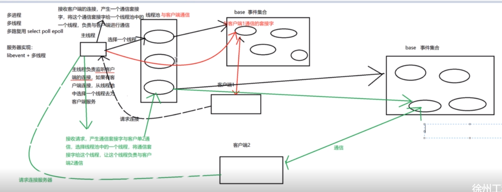
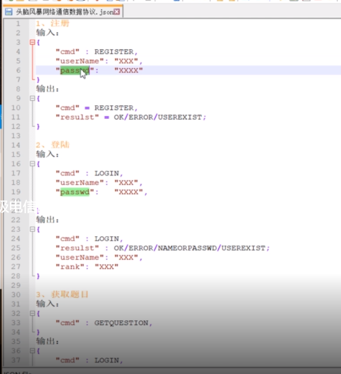
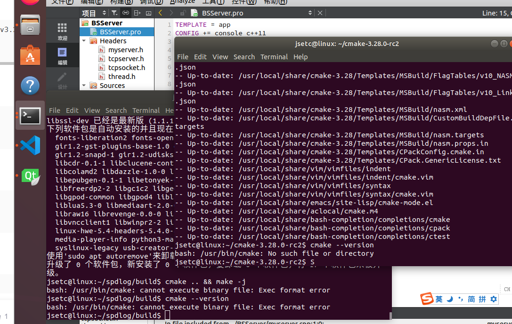
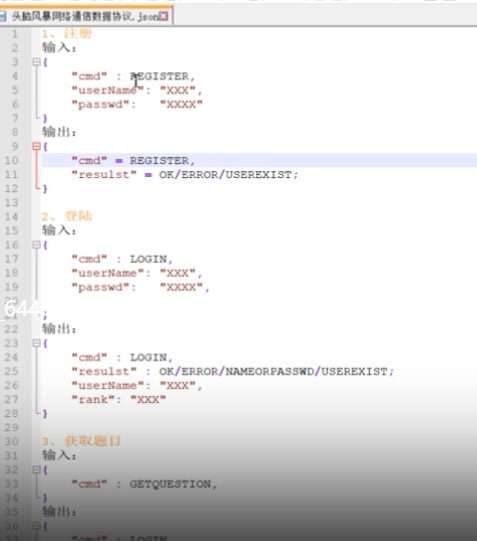
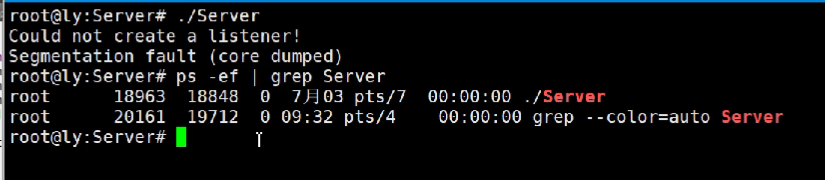
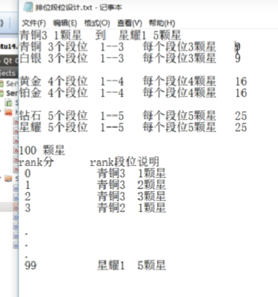
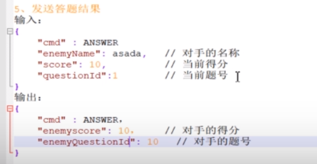
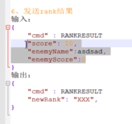
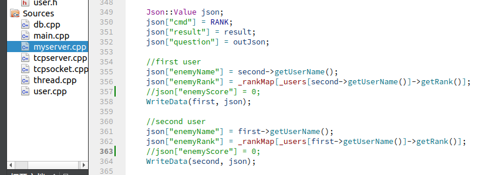

https://blog.csdn.net/m0_46044243/article/details/126724965?ops_request_misc=&request_id=&biz_id=102&utm_term=Qt%20libevent&utm_medium=distribute.pc_search_result.none-task-blog-2~all~sobaiduweb~default-8-126724965.142^v96^pc_search_result_base5&spm=1018.2226.3001.4187

## 服务器

进程池中主进程和子进程用管道通信
在线程池中也可以用管道进行主线程与子线程通信
base事件监听管道的读端，主线程在管道写端写入数据

每一个线程都有一个base，fd放在base里，就知道用哪个线程通信


客户端 从线程池中选择一个线程去处理客户端的请求
虚函数 去具体处理客户端的逻辑


spdlog日志


## 客户端
网络上的消息传递都是通过json的文本形式接收




Json



map存放在线用户列表

删除多余进程：





brainStorm.h:
    explicit BrainStorm(Communication *com, QJsonObject &json, QWidget *parent = nullptr);
添加QJsonObject &json以便在void setEnemyScore()；获取自己的用户名


cd QtProject/BrainStorming/build-BSServer-Desktop_Qt_5_12_2_GCC_64bit-Debug


要告诉对手名称


回答一道问题
信号发送给自己


关于Json["enemyscore]



知识点：
分别在Windows和Linux下构建客户端和服务器
采用C/S架构，利用TCP协议通信，通过spdlog在服务器端记录日志信息
采用libevent事件通知库 + 线程池的 高并发服务器框架
采用json数据格式进行服务器与客户端之间的数据交换
采用mysql对用户信息与比赛结果进行存储，利用map容器记录在线用户，查询结果保存到json变量中

选择libevent原因：非常轻量级，可跨平台，内部实现epoll。为了处理每个请求还提供了一种事件机制，让连接添加处理函数变得几遍，同时降低底层I/O复杂性。还有其他功能http server。
是基于事件的异步通信模型==回调。
> http服务框架：设置监听地址、端口、超时时间，注册处理回调函数，编写回调函数（拿取http报文的url、header/body）
除了响应事件，还要数据缓冲，libevent提供了一种通用机制即bufferevent。由一个底层的传输端口（如套接字），一个读缓冲区和一个写缓冲区组成。
1.普通事件在创建时就设置回调函数，二eventbufferevent事件需要再使用一个函数设置回调函数。
```C++ 
// 监听回调函数  监听是否有客户端连接
void TCPServer::listenCallback(evconnlistener *, evutil_socket_t fd, sockaddr *clientAdd, int socklen, void *data)
```
2.之前在服务器-客户端通信中，服务器使用socket、bind、listen、accep建立连接并监听客户端，现在也一个函数搞定，当这个函数的回调函数被调用，说明已经有新的客户端连接上来了。
```C++
m_listener = evconnlistener_new_bind(m_base, listenCallback, this,
                                         LEV_OPT_REUSEABLE|LEV_OPT_CLOSE_ON_FREE, -1,
                                         (struct sockaddr*)&sin, sizeof(sin));
```
3.libevent实现TCP服务器流程
(1)创建event_base
(2)创建服务器连接监听器evconnlistener_new_bind()
(3)在evconnlistener_new_bind的回调函数中，处理接受连接后的操作
(4)回调函数被调用，说明有一个新的客户端连接上来。会得到一个新的fd，用于跟客户端通信(读、写)
(5)使用bufferevent_socket_new创建一个新的bufferevent事件，将fd封装到这个事件对象中
(6)使用bufferevent_setcb给这个事件对象的read、write、event设置回调
(7)设置bufferevent的读写缓冲区enable/disable
(8)接收、发送数据bufferevent_read()、bufferevent_write()
(9)启动循环
(10)释放资源

感受：
在使用libevent库的时候明显能感觉到很方便，就是搭架子，然后再组装在一起，难点就是函数太多，初学不好记


抽象工厂：简单题，中等题，困难题；历史题，数学题。。
单例配置xml，json本地化配置
对于数据存储，只保留一份信息文件

界面换肤色：单例模式


外观模式
1.答题系统
离线系统：不连服务器，就无需添加网络模块，题目读本地文件，分数读本地文件
在线模式：
2.QQ音乐：外观模式
在线模式、VIP模式、游客模式（只能访问本地音乐，无法获取远程）