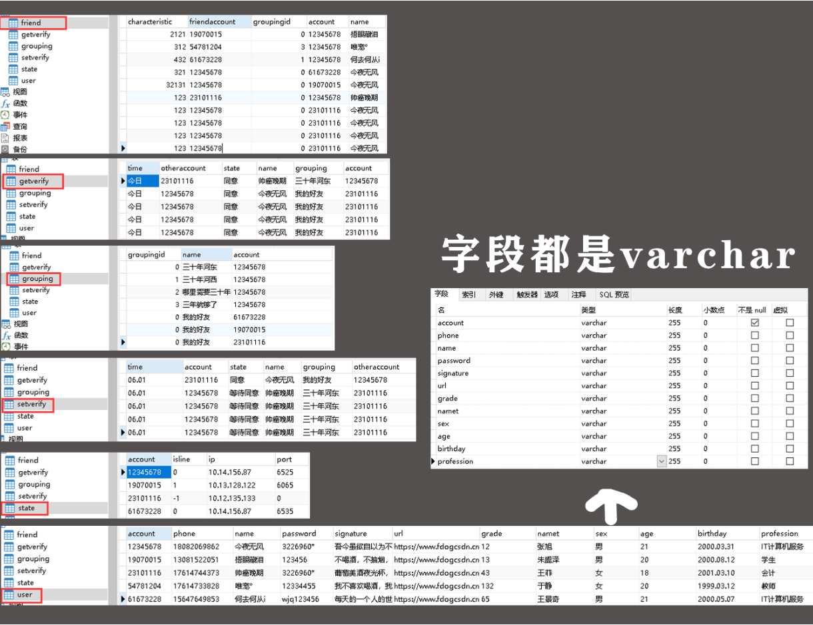

服务器端：
1.QTCPSocket创建套接字（用于**监听**的套接字对象）
2.listen（QHostAddress::any, port）；指定端口对任意的IP地址进行监听
QHostAddress::Any 执行了绑定地址的操作，IPV4 IPV6
port=0，则服务器随机分配一个端口
（1）isListening判断监听
（2）QHostAddress QTcpServer::serverAddress() const
如果当前服务器对象正在监听，则返回监听的服务器地址信息，否则返回NULL。
（3）QHostAddress QTcpServer::serverPort() const
（4）QTcpSocket *QTcpServer::nextPendingConnection()
返回下一个挂起的连接作为已连接的QTcpSocket对象。
开启监听后，若有客户端连接上来，服务器就与客户端建立连接，并会有一个用于**通信**的套接字。
（5）bool QTcpServer::waitForNewConnection(int msec = 0, bool *timedOut = Q_NULLPTR)
等待新连接。是一个阻塞函数，在客户端连接进来之前一直阻塞当前服务器的进程。**不推荐使用，推荐信号和槽**
信号：
（6）TcpServer::newConnection()
（7）TcpServer::acceptError()由此可知连接失败的原因
3.QTcpServer::newConnection()信号检测是否有新的客户端连接
4.若发出了newConnection()的信号，说明有新的客户端连接，就在newConnection对应的槽函数调用QTcpSocket *QTcpServer::nextPendingConnection()
5.使用**通信**的套接字对象QTCPSocket和客户端进行通信：QTCPSocket中提供了接收和发送数据的read和write；并且在QTCPSocket中提供了3个信号：
（1）QIODevice：：readRead()：可知对端有无发送数据过来，若有QTCPSocket发出readyRead信号， 在对应的槽函数中做对应的read操作。
（2）void QAbstractSocket::connected()；是在客户端进行检测连接，服务器端不可以使用。
（3）void QAbstractSocket::disconnected()；服务器端和客户端都可以使用，某一端断开连接，则发出信号告知对端。

客户端：
1.设置IP和PORT
serverIP = new QHostAddress();
2.if(!serverIP->setAddress(ip)) 判断给定的IP地址是否被正确解析
3.tcpsocket->connectToHost(*serverIP, port)  与服务器连接，成功后发送connected信号
（1）readyRead 准备接收数据
（2）connected
（3）tcpsocket->disconnectFromHost(); 与服务器断开连接，成功发出disconnected()信号
（4）disconnected() 断开连接

