[TOC]

# 课程来源于胖达说测试
# 一、计算机基础知识
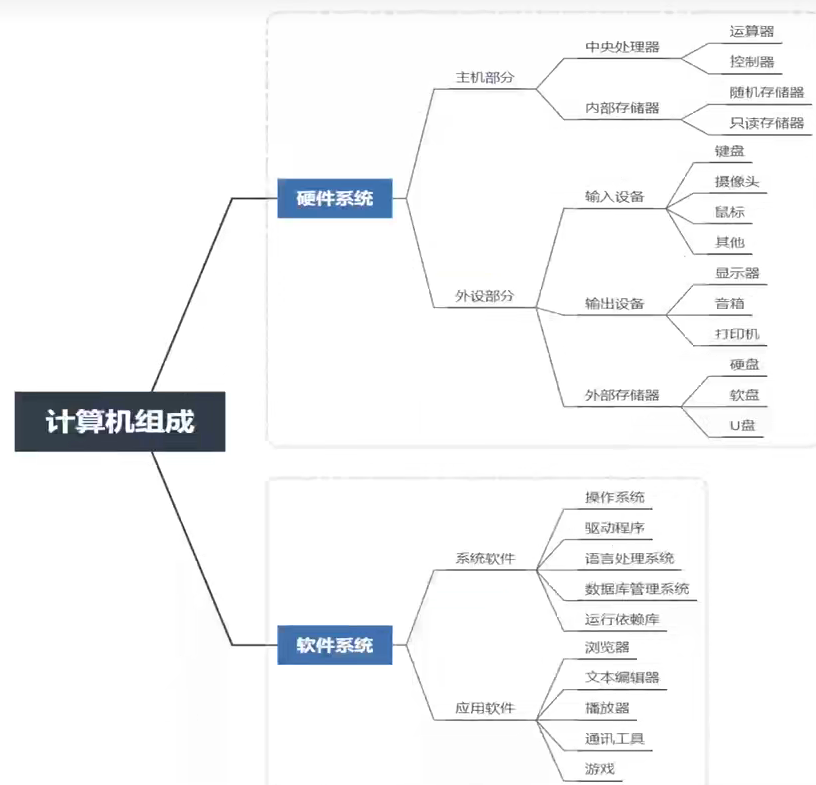

# 二、html和css基础
## 1.表单
 表单标签
 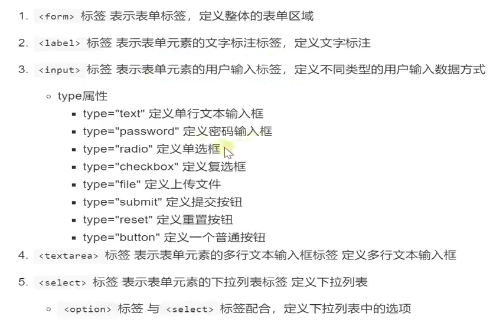

 表单属性设置：
 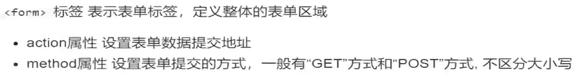

表单元素属性设置：
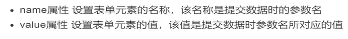

## 2.css三种引入方式:
### 1.行内式
直接在标签的style属性中添加css样式
```html
<div style="width: 100px;height: 50px; background-color: plum;">hello</div>
```
### 2.内嵌式
在<.head.>标签内加入<style.>标签，在<style.>并且中编写css代码
```html
<head>
    <style>
        p{
            color: aquamarine; 
        }
    </style>
</head>
```
### 3.外链式
将css代码单独写在css文件中，在<.head.>标签中使用<.link.>标签直接引入该文件到页面中。
```html
<link rel="stylesheet" type="text/css" href="main.css">
```

## 3.css选择器
选择标签给标签加样式。
css选择器种类：
1.标签选择器(以标签开头)
2.类选择器(以.开头，一个类选择器可用于多个标签，一个标签也可以使用多个类选择器，多个类选择器用空格分隔)
```html
<style type="text/css">
    .blueviolet{color: blueviolet;}
    .big{font-size: 20px;}
    .box{width: 100px;height: 30px;background: antiquewhite;}
</style>

<div class="blueviolet">这是一个div</div>
<h4 class="blueviolet big">这是一个标题</h4>
<p class="blueviolet box">这是一个段落</p>
```
3.层级选择器(根据层级关系选择后代标签，以选择器1 选择器2开头，主要用在标签嵌套的结构中，减少命名)
```html
<style type="text/css">
    p{
        color: aquamarine; 
    }
    div{
        color: cadetblue;
    }
    div p{
        color: chartreuse;
    }
    .con{width: 300px;height: 100px;background: green}
    .con span{color: aqua}
    .con .pink{color: pink}
    .con .palevioletred{color: palevioletred}
</style>
<div class="con">
    <span>hahahahaha</span>
    <a href="#" class="pink">百度</a>
    <a href="#" class="palevioletred">新浪</a>
</div>
```
4.id选择器(以#开头，元素的id名称不能重复，id选择器只能对应于页面上一个元素)
id名一般给程序使用，不推荐使用id作为选择器。
```html
<style type="text/css">
    #box{color: yellow;}
</style>

<p id="box">这是一个段落标签</p>
<p>这是第二个段落标签</p>
<p>这是第三个段落标签</p>
```
5.组选择器
```html
<style type="text/css">
    .box1,.box2,.box3{width: 50px;height: 50px;}
    .box1{background-color: darkmagenta;}
    .box2{background-color: darkorchid;}
    .box3{background-color: darkviolet;}
</style>

<div class="box1">这是一个div</div>
<div class="box2">这是一个div</div>
<div class="box3">这是一个div</div>
```
6.伪类选择器(以：分割，当用户和网站交互的时候改变显示效果)
```html

```

## 4.css属性
### 1.常用属性
1.布局常用样式属性：
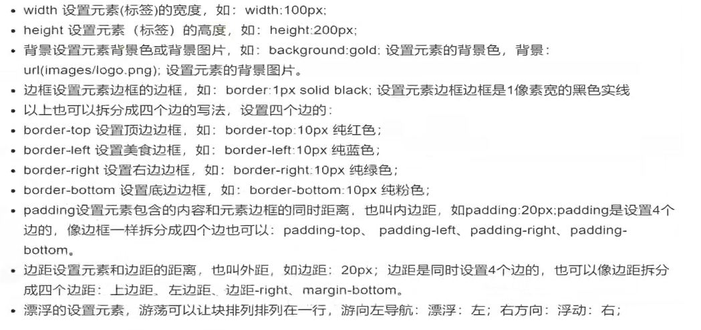
2.文本常用样式属性：
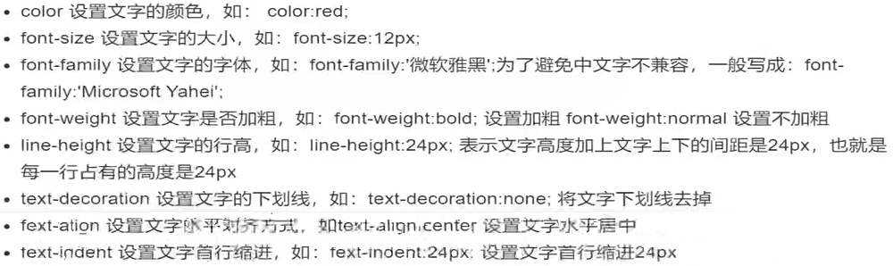

### 2.css元素溢出
当子元素（标签）的尺寸超过父元素的尺寸时，需要设置父元素显示溢出的子元素的方式，通过overflow属性完成。
overflow设置项：
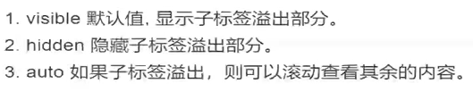

### 3.css显示特性
1.display属性
是用来设置元素类型及隐藏的，常用的属性有：
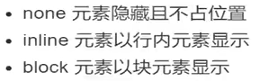

### 4.盒子模型
把HTML页面看做一个矩形盒子，有内容、内边距、边框、外边距四块组成。
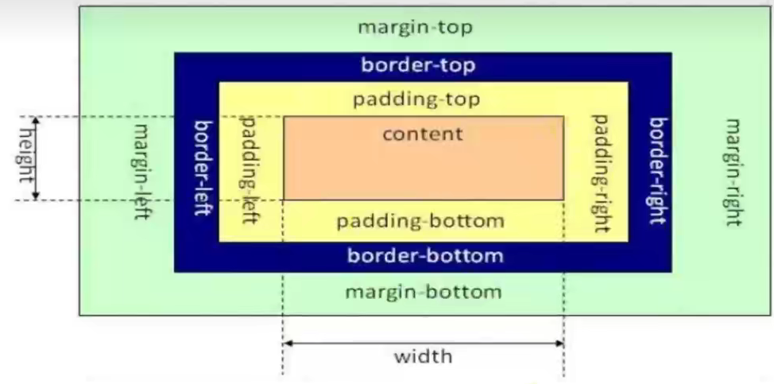

## 5.补充
```html
<a herf="www.baidu.com"> 你好</a>
#a是标签,若没有文本“你好”，只有属性，可以简写成如下：
<a herf="www.baidu.com"/>
```

# 三、测试与开发模型
## 1.测试工作流程
需求分析
测试计划和测试方案
测试用例设计
测试用例执行
评估阶段 测试报告
## 2.开发模型
### 1.瀑布模型
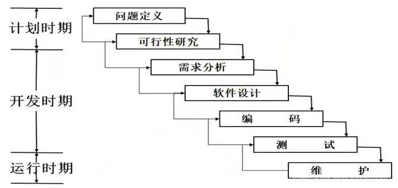

特点：
1.阶段间具有顺序性和依赖性
2.推迟实现
3.质量保证的观点
总结：瀑布模型是文档驱动的模型，遵守这个约束可使软件维护变得比较容易一些，从而降低软件预算。
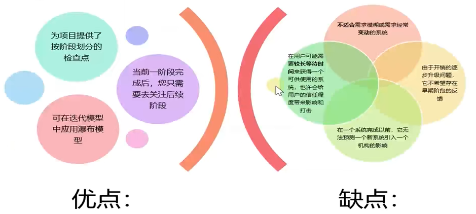

### 2.快速原型
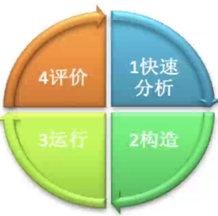

特点：是快速建立起来可以在计算机上运行的程序。
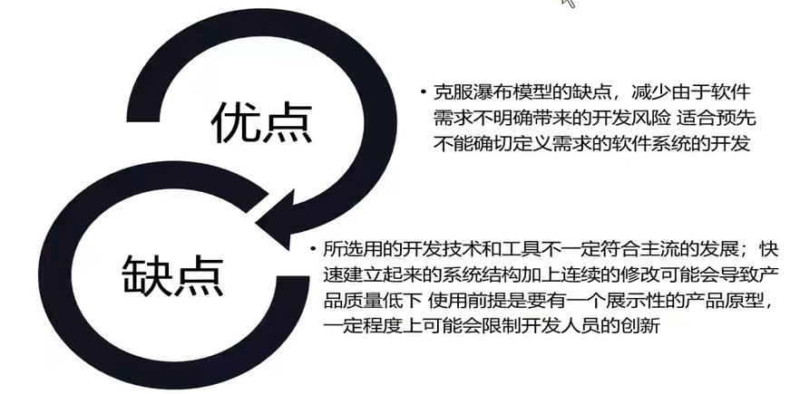

### 3.增量模型
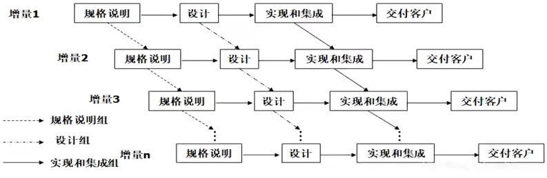

特点：把瀑布模型的顺序特征和快速原型的迭代特征相结合，将软件看作一系列相互联系的增量，在开发过程的各次迭代中，每次完成其中的一个增量。
### 4.其他模型
螺旋模型、迭代模型、敏捷模型

## 3.测试模型
### 1.v模型
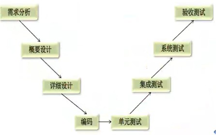

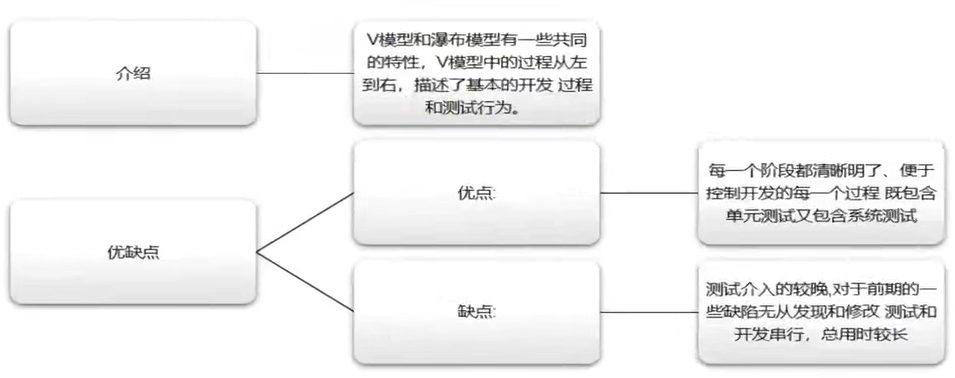

### 2.w模型
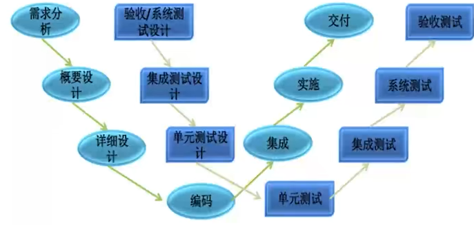

介绍：
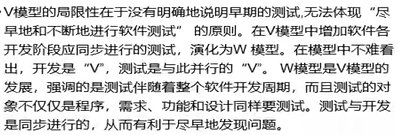

特点：
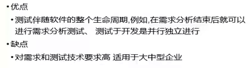

## 4.软件测试分类
### 1.测试（开发）阶段
### 2.是否覆盖码源
黑盒测试:不关注源代码，针对程序UI功能进行测试。功能测试（UI测试、业务测试、文档测试、易用性测试、安装卸载测试、兼容性测试）和性能测试（一般测试（CPU使用率、GPU、内存）、稳定性测试、负载测试、压力测试）
灰盒测试:针对程序部分代码进行测试（接口）（输入输出、程序运行状态）
白盒测试:针对程序源代码进行测试（语句覆盖、判断覆盖、条件覆盖、路径覆盖）
### 3.是否运行
静态测试（测试程序结构、程序过程、接口是否正常、代码风格是否符合标准）、动态测试
### 4.是否自动化
### 5.地域测试
### 6.其他测试分类
回归测试、冒烟测试、随机测试（monkey测试）、探索测试

测试用例：
特性：有效性、可复用性、易组织性、可评估性、可管理性


# 移动测试
1.ADB 
定义：
安卓调试桥，即包含ADB服务，也包含了与服务对应的Client
作用：通过命令去操作手机。
关系：
在电脑上创建一个服务，手机连上电脑后，会与服务建立连接，要想发送指令给手机，就要吧指令发送到服务中。
命令：
1.服务：（如果发现代码连不上手机）
> adb kill-server
> adb start-server
2.查看设备：
> abd devices
3.进入手机终端
> adb shell
4.获取信息
> adb shell getprop ro.build.version.release 获取手机android版本
> adb shell dumpsys window windows | findstr mFocusedApp 获取时间当前运行的程序和界面的名称
5.文件传输
> adb push 电脑上的文件 手机上的位置
> adb pull 手机上的文件 电脑上的位置


# 基础操作

元素定位工具,网页html，xml元素快速查找：uiautomatorviewer.bat
D:\WebDownloads\android-sdk_r24.4.1-windows\android-sdk-windows\tools\bin

## driver
install_app('apk在电脑的绝对路径') 安装应用
remove_app('应用包名') 卸载应用
is_app_installed() 判断释放安装应用
push_file(目标位置)返回值是base64编码的内容  
pull_file 获取界面xml码源
page_source
find_element 
current_package 获取当前操作的应用名称
current_activity 获取当前操作的界面名称

## element
text 获取元素文本内容
click() 点击元素对应位置
get_attributr(属性名称) 获取属性值
location 获取元素左上角的坐标
size 获取元素的宽高(字典)

## 输入文本
send_keys("文本内容")
```
driver.find_element_by_xpath("//*[]").send_keys("")
```
输入中文时要加入以下：
> desired_caps['unicodeKeyboard'] = True #unicode设置，允许中文输入
> desired_caps['resetKeyboard'] = True #键盘设置，允许中文输入
* 如果对于同一个元素，多次调研此方法，会先一个一个删除掉原有内容，再输入

clear() 清空文本框内容

# 模拟手势
1.滚动
```
swipe(self,start_x: int,start_y:int,end_x:int,end_y:int, duration:int = 0)
```
> 注意duration默认值的600单位是毫秒
> click方法，实际上不是点元素，而且点元素所在位置。在获取的时候有位置，但经过滑动，位置发生了变化，可能点不准。非常有可能在点击之前睡一会，等待滑动结束。

```
scroll(origin__el, destination_el,duration)
```
scroll直接传递元素作为参数即可，不需要手动获取位置。
scroll底层实现有swipe一些区别，没有中间的采样点，只有起始，结束，但最终效果一样。
2.拖拽